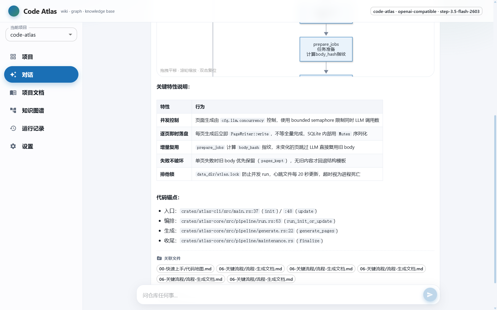
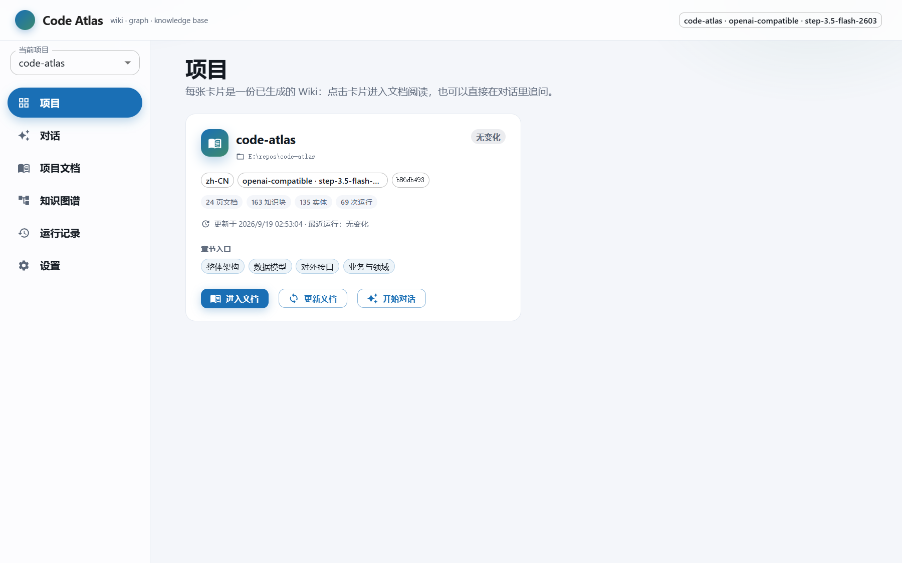
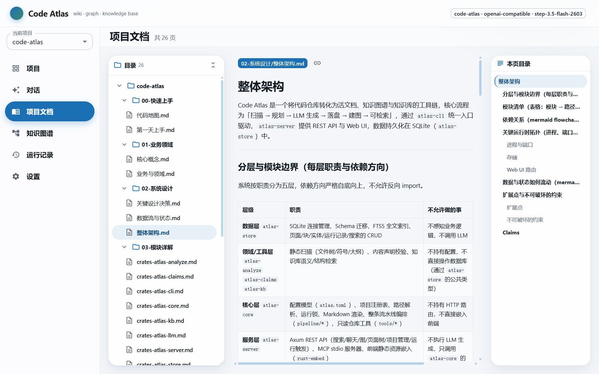
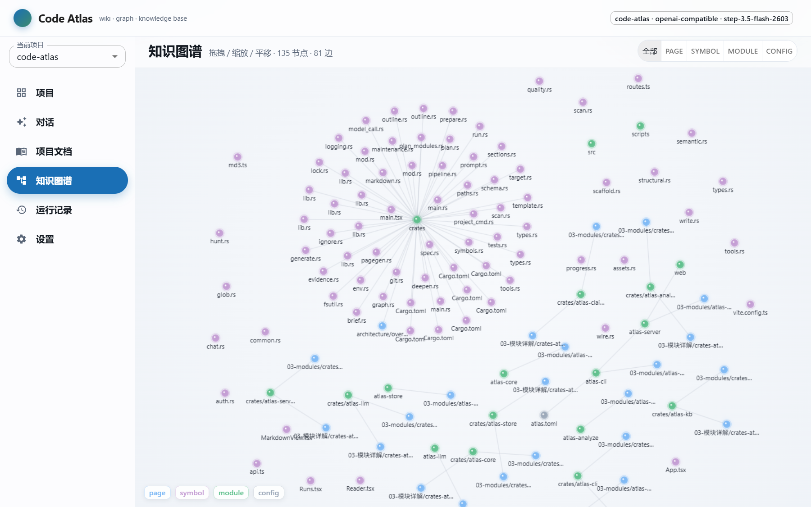
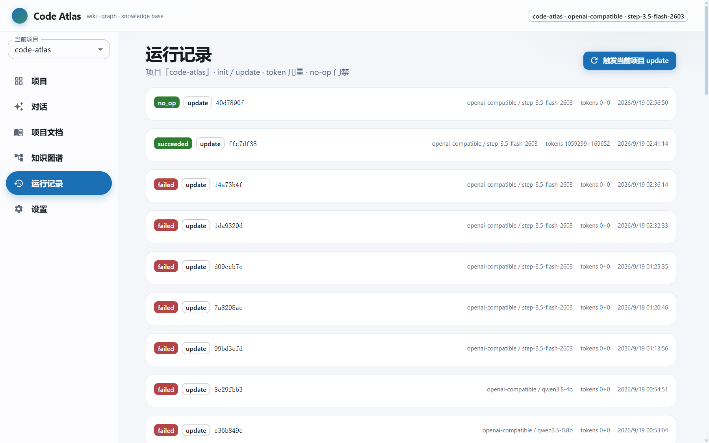
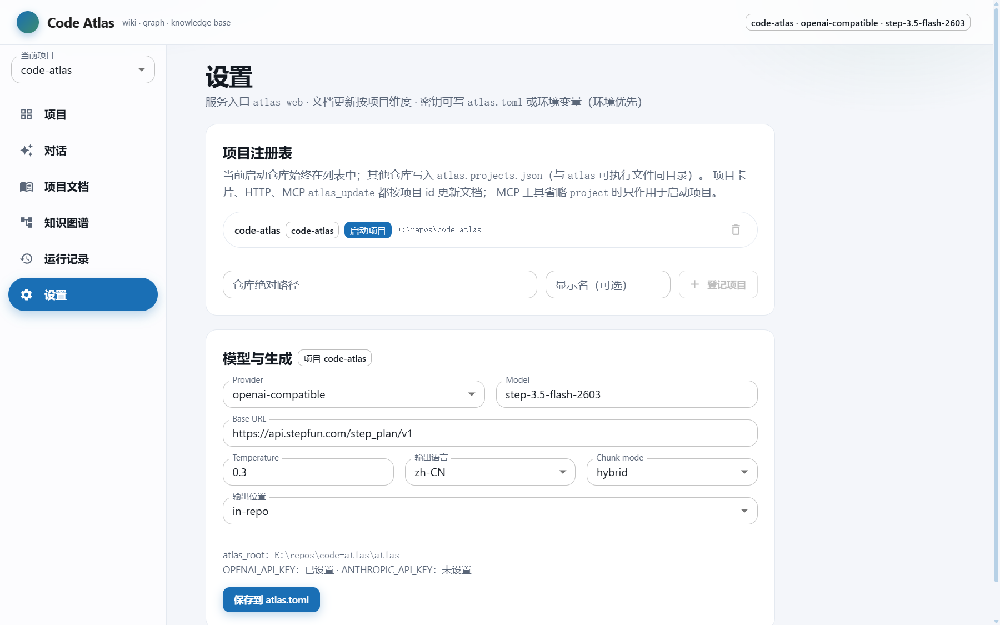

# Code Atlas

**A living wiki, knowledge graph and searchable knowledge base, generated from your codebase.**

The model does not guess from the outside: it is given read-only repository tools (`read_file`, `grep`, `find_defs`, `git_log`, …) and gathers evidence on demand, so every page it writes carries real `path:line` anchors. When your code changes, the next incremental update rewrites only the pages that were affected.

English · [中文](README.md)



## Table of contents

- [What it solves](#what-it-solves)
- [Screens](#screens)
- [Install](#install)
- [Quick start](#quick-start)
- [CLI reference](#cli-reference)
- [MCP](#mcp)
- [How generation works](#how-generation-works)
- [Compression and size](#compression-and-size)
- [Configuration](#configuration)
- [Project layout](#project-layout)
- [Security notes](#security-notes)
- [Development](#development)

## What it solves

Taking over an unfamiliar repository, what you miss first is never "what does this file do" — it is the **cross-module causality**: where data enters, which layer persists it, what breaks if you change one thing. Code Atlas hands that job to a model plus a graph and produces two assets you can keep maintaining:

| Asset                      | Location                    | Purpose                                                                                                                                           |
| -------------------------- | --------------------------- | ------------------------------------------------------------------------------------------------------------------------------------------------- |
| **Wiki pages**             | `atlas/*.md`                | Chapters for onboarding / domain / system design / modules / data model / interfaces / flows / operations, with mermaid diagrams and code anchors |
| **Knowledge base + graph** | `data/*.db` (SQLite + FTS5) | Backs `atlas search`, the web chat, graph browsing and the MCP tools                                                                              |

Three deliberate trade-offs:

- **Evidence first.** Every factual claim traces back to `path:line`; a file the model never read may not have an invented line number.
- **Incremental first.** If a page fingerprint (scope + evidence + module file list) is unchanged, the model is skipped — no money burnt twice.
- **Cost is visible.** The run summary prints prompt-cache hit rate, characters saved by tool-output compression, and tool-cache hit rate.

## Screens

### Project home

One card per repository: page / chunk / entity / run counts, last-update status, section entry points.



### Document reader

A collapsible document tree on the left, anchored prose and mermaid diagrams on the right. Diagrams support zoom, pan, fullscreen and copy-source.



### Knowledge-base chat

A streamed answer plus a **recalled-context panel** (page path, line range, snippet). When recall is not enough, the model calls `grep` / `read_file` against the repository itself and then answers — asking for a constant that only exists in source code still gets a correct reply.


### Knowledge graph

Entities and relations come from a deterministic symbol graph plus model extraction, drillable by neighborhood.



### Runs and settings

Model, duration, tokens, cache hits and incremental decisions for every init / update. The settings page edits provider / model / output language / chunk strategy.





## Install

### Prebuilt binaries (recommended)

Grab your platform from [Releases](https://github.com/wosledon/code-atlas/releases) and unpack — **a single executable with the UI embedded, no Node and no extra files**:

| Platform            | Artifact                                |
| ------------------- | --------------------------------------- |
| Windows x64         | `atlas-x86_64-pc-windows-msvc.zip`      |
| Linux x64           | `atlas-x86_64-unknown-linux-gnu.tar.gz` |
| macOS Apple Silicon | `atlas-aarch64-apple-darwin.tar.gz`     |
| macOS Intel         | `atlas-x86_64-apple-darwin.tar.gz`      |

Each release ships a `SHA256SUMS` for verification. Linux builds target Ubuntu 22.04 (glibc 2.35) so they run on newer distributions too.

### From source

```bash
cd web && npm install && npm run build && cd ..   # must come first: embedded at compile time
cargo build --profile dist -p atlas-cli           # size-oriented profile, see below
```

> The frontend build is a **compile-time dependency**: `crates/atlas-server/build.rs` only gzips and embeds `web/dist` when `web/dist/index.html` exists. Build in the wrong order and the binary ships without a UI (it falls back to a built-in placeholder page). `scripts/smoke-binary.sh` exists to catch exactly that.

## Quick start

### 1. Configure

```bash
./atlas init-config      # writes atlas.toml (env vars alone also work)
```

Credential precedence: environment variables over `atlas.toml`.

```bash
export OPENAI_API_KEY=...      # or ANTHROPIC_API_KEY; local Ollama needs none
export ATLAS_MODEL=...         # optional, overrides atlas.toml
```

### 2. Generate the wiki + knowledge base

```bash
./atlas plan    # preview the planned pages, no model calls
./atlas init    # first generation
./atlas update  # later incremental updates (0 model calls when nothing changed)
```

### 3. Use it

```bash
./atlas search "authentication flow"   # hits include body text and line ranges
./atlas web                            # Web UI + REST API (port 4321)
```

## CLI reference

```
atlas init          [--ci] [--instruction <text>] [--provider P] [--model M]
atlas update        [--ci] [--instruction <text>] [--provider P] [--model M]
atlas search <query> [--limit N]       # backend chosen by [kb] search
atlas status [--last]                  # recent runs
atlas reindex                          # rebuild the SQLite index from markdown
atlas plan [--instruction <text>]      # preview the page plan, no model calls
atlas web [--port 4321] [--web-dist <dir>]   # alias: serve
atlas export <dir>                     # export wiki markdown
atlas check                            # read-only integrity check (entry pages, length, links)
atlas init-config [--example] [--force]      # alias: config
atlas project <subcommand>             # alias: projects, manage the project registry
atlas mcp                              # MCP stdio server
```

Global flags: `--path <repo-root>` (auto-detected by default) and `--project <id>` (target a registered project).

Under `--ci`, only **real problems** exit 1: broken links, too-short bodies, a missing entry page, or a large-scale model fallback to templates.

## MCP

`atlas mcp` speaks MCP over stdio and can be mounted in any MCP-capable editor:

| Tool                                                          | Purpose                                                                       |
| ------------------------------------------------------------- | ----------------------------------------------------------------------------- |
| `atlas_search`                                                | Search the knowledge base; hits carry page path, line range and recalled body |
| `atlas_read_page` / `atlas_list_pages`                        | Read a wiki page / list generated pages                                       |
| `atlas_write_page` / `atlas_patch_page` / `atlas_delete_page` | Create, line- or text-edit, delete a page (optionally reindexing)             |
| `atlas_get_chunks`                                            | Inspect the chunks indexed for a page                                         |
| `atlas_list_entities` / `atlas_graph_neighborhood`            | Entities and their relations                                                  |
| `atlas_plan` / `atlas_check` / `atlas_reindex`                | Plan preview, integrity check, index rebuild                                  |
| `atlas_update`                                                | Run the init/update pipeline (calls the model; takes minutes)                 |
| `atlas_status` / `atlas_repo_info` / `atlas_list_projects`    | Run history, repository overview, project registry                            |

## Web UI and API

`atlas web` is the single entry point (`serve` is a compatibility alias). The frontend is embedded in the binary by default; `--web-dist` points at an external directory.

| Page                   | Description                                                             |
| ---------------------- | ----------------------------------------------------------------------- |
| `/`                    | Project cards                                                           |
| `/reader?p=<rel_path>` | Wiki reading (deep links are shareable)                                 |
| `/chat`                | Knowledge-base chat                                                     |
| `/graph`               | Knowledge graph                                                         |
| `/runs`                | Run history                                                             |
| `/settings`            | Settings (LLM / language / chunks / output location / project registry) |

Main endpoints: `/api/health` · `/api/projects` · `/api/pages` · `/api/pages/<rel_path>` · `/api/kb/search` · `POST /api/kb/chat` (SSE) · `/api/graph/nodes` · `/api/runs` · `/api/config` · `POST /api/run/update`

## How generation works

- **Concurrency:** 5 page workers by default (`[llm] concurrency` / `ATLAS_CONCURRENCY`).
- **Tools:** the model may call the read-only tools `list_files` / `list_tree` / `read_file` / `grep` / `find_defs` / `git_log` instead of receiving the whole repository in the prompt. Budget via `[llm] max_tool_rounds` (`0` disables tools entirely, generating from evidence only).
- **Incremental:** an unchanged page fingerprint (focus + evidence + module file list) reuses the existing body and skips the model; an unchanged body reuses chunks; pages that disappeared from the tree are removed along with their chunks.
- **Chunking:** `[kb.chunk] mode` defaults to `hybrid`: the model picks boundaries and writes summaries, so a chunk is summary + content. Without a model it degrades to structural splitting.
- **Prompt cache:** requests are ordered most-stable-first (a byte-identical system prompt → run-shared evidence → page-specific instructions), and the depth rewrite reuses the first pass's prefix. The run summary prints the hit rate.
- **Without a key:** the pipeline drops straight into template mode (a single advisory note) instead of retrying page by page.

## Compression and size

Saving tokens and saving disk are two different jobs; both are measured here.

### Tool-output compression (tokens)

The model reads text, so compression may only be a **semantics- and character-preserving** rewrite — no gzip-style encoding that needs a decoder. The pipeline lives in `crates/atlas-core/src/tools/compress.rs` and runs four passes:

| Pass                               | Removes                                          | Applies to        |
| ---------------------------------- | ------------------------------------------------ | ----------------- |
| Whitespace normalization           | CRLF, trailing blanks                            | every tool result |
| Blank-run collapsing               | runs of ≥3 blank lines → 1                       | every tool result |
| **Per-block indentation hoisting** | a block's common indent (one marker per block)   | `read_file` only  |
| **Repeated-line folding**          | runs of ≥4 identical lines → first line + `(xN)` | `read_file` only  |

Indentation hoisting is the only language-aware step, behind three gates: an **extension allow-list** (anything unlisted is left alone, so Python / YAML / Markdown and friends are safe by construction), a **multi-line-string guard** (leading spaces inside Go raw strings, JS template literals or Java/C# text blocks are data — those lines are detected and skipped), and a **payoff threshold** (if the saved characters don't cover the marker, nothing is touched). Markers are self-describing and carry no line number:

```
// begin: 8 spaces omitted per line
12|     if sql == "" {
// end
```

Adding back N leading spaces restores the bytes exactly, so `path:line` references stay valid. Measured on 850k characters of this repo's rs/ts/tsx/json: **6.2% saved by per-block hoisting** (versus 2.6% for whole-window hoisting and 0.9% for equal-indent segments). Accounting is in **characters, not bytes** — one CJK character is 3 bytes but roughly one token, so byte counts would overstate the win about threefold.

There are two pipelines rather than one: `read_file` numbers every line, and collapsing blank lines would shift those numbers, so it runs "per-line clipping → hoisting → folding"; every other tool result is free text and runs `compact` (line-end normalization + blank-run collapsing).

### Tool-result caching (no repeated reads or repeated reasoning)

- **Call level:** the key is the tool name plus normalized arguments (order-insensitive), so a repeated call returns instantly.
- **File snapshots:** `read_file` reads each file from disk once per run and serves *any* later line range from the snapshot — shifted windows, overlapping ranges and second passes all hit.

### Binary size (disk)

Release artifacts use a dedicated `dist` profile: **12.03 MB → 6.35 MB** measured.

| Change                               | Effect                                            |
| ------------------------------------ | ------------------------------------------------- |
| `panic = "abort"`                    | 12.03 → 9.19 MB (-24%)                            |
| `opt-level = "z"` + `lto = "fat"`    | → 6.35 MB (-47% total)                            |
| `strip = true` + `codegen-units = 1` | drops symbols, gives LTO room                     |
| Frontend gzipped and embedded        | the whole UI is ~1.6 MB (about 5 MB uncompressed) |

`opt-level = "z"` costs almost nothing on a program whose hot paths are IO and network rather than compute. Nothing in the workspace uses `catch_unwind`, so `panic = "abort"` changes no behaviour. The final Windows zip is just **4.2 MB**.

## Configuration

See [`atlas.toml.example`](atlas.toml.example) for a fully commented example. Common keys:

| Section      | Key                                                                                          | Meaning                                                           |
| ------------ | -------------------------------------------------------------------------------------------- | ----------------------------------------------------------------- |
| `[llm]`      | `provider` / `model` / `base_url` / `api_key`                                                | Provider and model: `openai-compatible` / `anthropic` / `ollama`  |
|              | `temperature` / `max_output_tokens` / `concurrency` / `timeout_secs` / `retries`             | Generation parameters                                             |
|              | `max_tool_rounds`                                                                            | Read budget (×3 read-only calls); `0` disables tools              |
|              | `depth_pass`                                                                                 | Let the model expand a page once when the first draft is too thin |
| `[privacy]`  | `redact_paths` / `max_file_bytes`                                                            | Paths and file sizes that never enter the context                 |
| `[graph]`    | `llm_extract` / `max_neighborhood_depth` / `authoritative_min_confidence`                    | Graph construction and drill-down                                 |
| `[kb]`       | `search` / `embed_model` / `max_context_bytes`                                               | Retrieval backend (default `fts5`) and context budget             |
| `[kb.chunk]` | `mode` / `target_tokens` / `max_tokens` / `min_tokens` / `summary_tokens` / `overlap_tokens` | Chunking strategy                                                 |

Environment overrides: `ATLAS_PROVIDER` / `ATLAS_MODEL` / `ATLAS_BASE_URL` / `ATLAS_API_KEY` / `ATLAS_CONCURRENCY` / `ATLAS_TOOL_ROUNDS` / `ATLAS_MAX_OUTPUT_TOKENS` and more.

## Project layout

```
crates/
  atlas-cli       CLI entry point and command dispatch
  atlas-core      Config, paths, locking, markdown, generation pipeline, read-only repo tools
  atlas-analyze   Scanning, symbol extraction, outlines, ignore rules
  atlas-llm       LLM clients (OpenAI-compatible / Anthropic), SSE accumulation, tool rounds, dialect parsing
  atlas-kb        Chunking (structural / model / hybrid) and persistence
  atlas-store     SQLite: pages, chunks, FTS5, entities and relations, runs
  atlas-claims    Claims extraction and validation
  atlas-server    REST API + Web UI hosting + MCP server
web/              React 19 + Material Design 3 frontend
atlas/            Generated wiki (default output location)
data/             Generated SQLite database and lock files
```

## Security notes

`atlas web` has **no authentication** and binds `0.0.0.0` (every interface) by default, so a phone or another machine on the same network can open it directly. That means anyone on that network can:

- call `POST /api/run/update` and `POST /api/kb/chat` — **which really invoke the LLM and spend your credit**;
- call `POST /api/config` — which rewrites `atlas.toml`.

Fine at home or on your own hotspot; **do not run it on office or public Wi-Fi**. CORS only allows `localhost` origins, which stops other websites from reading your local API cross-origin in the browser, but it does not stop direct requests from inside the LAN.

Files matched by `[privacy] redact_paths` (`.env`, `*.pem`, `id_rsa*`, …) never enter the model context, but please still make sure no secrets are lying around in ordinary files that do get read.

## Development

```bash
cargo clippy --workspace --all-targets -- -D warnings   # one of the CI gates
cargo test --workspace                                   # full suite
bash scripts/smoke-binary.sh target/dist/atlas.exe       # proves the binary is self-contained
bash scripts/package-release.sh <triple> <binary>        # package locally
```

Pushing a `v*` tag triggers the [Release workflow](.github/workflows/release.yml): four platforms build in parallel → smoke-tested → packaged → published as a GitHub Release with `SHA256SUMS`. Manual runs of that workflow are dry runs (they upload Actions artifacts but create no Release).

CI does not check `cargo fmt`: the repository carries a lot of pre-existing formatting drift, so enabling that gate would require reformatting everything first. `clippy -D warnings` and the full test suite are green.

## License

MIT — see [LICENSE](LICENSE).

## Documentation

The full product and engineering design lives in [`docs/DESIGN.md`](docs/DESIGN.md) (Chinese).
