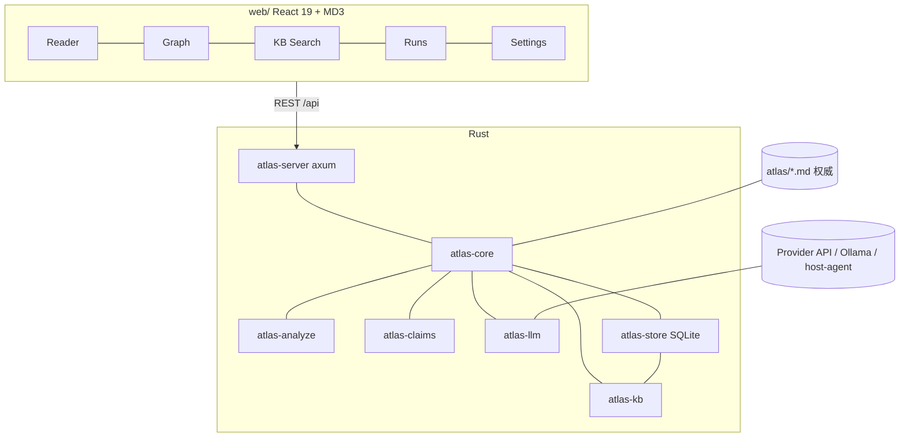
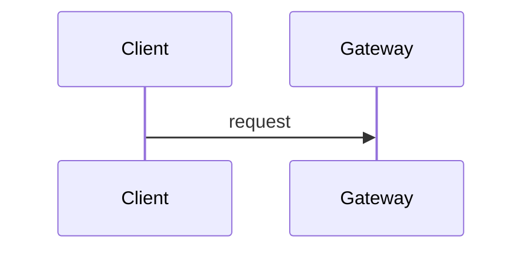
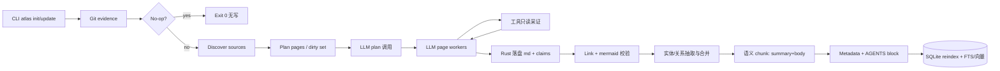
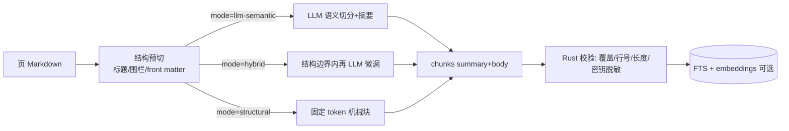

# DESIGN.md — Code Atlas

## 1. Objective

Code Atlas 让任何代码仓库在一次可重复运行后，拥有一份 **人与 Agent 都能读的活 Wiki**，以及可查询的**知识库与知识图谱**：事实锚定源码与 git 证据，更新只碰真正变过的页与图节点。质量标准是「下一次会话可以直接当记忆用」——不是生成一堆漂亮但不可核验的 README 衍生物。读完任何一页，读者应感到：结论可信、路径可点、缺口可指出；问「谁依赖 auth」时能从图谱/KB 得到带证据的答案。

## 2. Product Context

- **What the product does:** 扫描仓库，生成并持续维护主题化 Markdown Wiki（默认仓内 `atlas/`，可改 external/db-only）；在 SQLite 中沉淀**知识库**（实体/关系/Claims/符号/**语义 chunk**）与**知识图谱**，供检索、问答与可视化；后续运行只增量刷新受变更影响的页与图节点。
- **Who it for 的核心场景：** 工程师与编码 Agent 需要「某个模块被谁依赖 / 这条不变量的证据在哪 / 近一周改过什么」时，能在图谱与库中直接定位，而不是全文 grep。
- **Who it's for:** 在本仓库或客户仓库上工作的工程师与编码 Agent（Claude Code / Codex / Cursor 等）；次要读者是新 onboarding 的人类。
- **Adjacent brands (feel like these):** [LangChain OpenWiki](https://github.com/langchain-ai/openwiki)（生命周期与 Claims）、Linear Docs / Stripe Docs（克制的技术编辑感）、Excalidraw / Obsidian Graph（图谱探索，仅作 visualizer 气质参考）。
- **Distant brand (do not feel like this):** Notion 模板商店式的「知识库皮肤」——大量卡片、渐变封面、与代码证据脱节的装饰性信息图。
- **Cultural register:** technical + editorial。默认严肃可核验；不卖「一键颠覆文档」叙事。
- **Stack lock:** 后端 Rust + SQLite；前端最新稳定 React + Material Design 3（详见 §6）。

## 3. Visual Foundations

### 3a. Color（Material Design 3 seed）

以 **OpenWiki 蓝 `#1A6FB5`** 为 MD3 seed，生成完整 tonal palette 后映射到角色 token（UI 一律用 `var(--md-sys-color-*)`，不散落 hex）。

| MD3 role | Light | Dark | 用途 |
|---|---|---|---|
| `primary` | `#1A6FB5` | `#9CC5F0` | 链接、主操作、选中节点 |
| `on-primary` | `#FFFFFF` | `#0B2D4F` | 主按钮前景 |
| `primary-container` | `#D4E7FB` | `#14436E` | 选中导航条、chip 底 |
| `on-primary-container` | `#0A2B4A` | `#E3EEFA` | 容器内文字 |
| `secondary` | `#3D8B6E` | `#7FBF9F` | Claims OK / 已核验 |
| `secondary-container` | `#D7F0E4` | `#1E4A38` | 成功状态容器 |
| `tertiary` | `#8B6B9E` | `#C9A8DC` | stale / 证据漂移 |
| `error` | `#B54545` | `#F2B8B5` | 断链、证据解析失败 |
| `error-container` | `#F9DEDC` | `#8C1D18` | 错误横幅底 |
| `surface` | `#F7F8FA` | `#121418` | 画布与阅读底 |
| `surface-container` | `#EEF1F5` | `#1E232B` | 侧栏、工具栏 |
| `surface-container-high` | `#E2E7EE` | `#2A313C` | 悬停行 |
| `outline` | `#C9D1DB` | `#4A5563` | 分割线、字段边框 |
| `on-surface` | `#1C232B` | `#E8ECF2` | 正文 |
| `on-surface-variant` | `#4A5563` | `#A8B2C0` | 次级说明 |

- **Semantic extras（非 MD3 角色，仅状态）：**  
  `--status-warning: #B58A1A`（stale claim 待确认）· `--status-ok: #3D8B6E`（与 secondary 一致）
- **Usage rules:**  
  - UI 组件（AppBar、NavDrawer、FAB、Chip、Dialog）只吃 MD3 role；阅读正文默认 `on-surface`。  
  - accent/primary 只出现在链接、主按钮、图谱选中与导航指示；不得作大面积 surface。  
  - 禁止紫青渐变 hero、发光 glow；状态色只绑定 Claims/链接健康度。  
  - 默认支持 light/dark；导出静态站跟随系统 `prefers-color-scheme`。

### 3b. Typography

- **UI face（MD3 默认可覆写）:** `"IBM Plex Sans", "Segoe UI", system-ui, sans-serif`  
  M3 type roles：`headline-large` 32/40 · `headline-medium` 24/32 · `title-large` 20/28 · `title-medium` 16/24 · `body-large` 16/24 · `body-medium` 14/20 · `label-medium` 12/16。
- **Reading / code face:** `"IBM Plex Mono", "Cascadia Code", ui-monospace, monospace`；路径与符号 500。
- **Fallback stack:** `system-ui, "Segoe UI", "PingFang SC", "Microsoft YaHei", sans-serif`
- **Weight discipline:** MD3 建议权重；标题 500–600，正文 400。禁止 700+ 与斜体标题混用。
- **Wiki 渲染：** h1 ≤ 24、正文 15–16、行高 ≥ 1.55；阅读栏 max-width `720px`。

### 3c. Spacing & rhythm（MD3 4–8 网格）

- **Base unit:** `8px`（部分紧凑控件用 `4px`）
- **Scale:** `4, 8, 12, 16, 24, 32, 48, 64`
- **Layout tokens:** NavigationRail `80px` · ToolBar `64px` · 阅读栏 `720px` · 图谱最小视口 `480px`
- **Shape:** M3 — FAB `16px` · Dialog `28px` · Card `12px` · 图谱节点沿用 `8px`（比 MD3 Card 略紧，避免过大圆角）。

### 3d. Component seeds（Material 3 Web）

- **规范来源:** Material Design 3 全套 role tokens + 形状/动态 color 槽位；组件用 **MUI `@mui/material` v6+（`ThemeProvider` + MD3 design tokens）**，禁止自绘一套平行按钮体系。
- **Navigation:** 左 `NavigationRail`/`Drawer`（section 树）；顶 `TopAppBar`（仓库名、分支、no-op 状态）。
- **Actions:** FAB（`atlas update`）+ Menu；次级动作用 text button / icon button。
- **Feedback:** `Snackbar`（增量结果）· `Dialog`（破坏性全量重建）· `LinearProgress`（页队列）· `Chip`（`type` / claim 状态）。
- **Graph canvas:** 外围套 MD3 表面容器；节点内部仍为 SVG 矩形 + mono 标签，边用 `outline`/`primary`。
- **Iconography:** Material Symbols（`react-icons` / official）或等宽 inline SVG；无 emoji 图标。
- **Markdown 阅读区:** 不套 Card 堆叠；标题层级 + 相对链接 + 边注 Claims（`surface-container` 侧栏）。

## 4. Accessibility

- **Text contrast:** 正文 ≥ 4.5:1；大号 UI / 非文本控件 ≥ 3:1（`--n-400` 不得用于 13px 正文）。
- **Motion:** 默认尊重 `prefers-reduced-motion`；图谱入场位移 ≤ 150ms 或直接跳过。
- **Focus indicators:** `2px solid var(--accent-primary)` + 2px offset；图谱节点键盘可达。
- **Alt text policy:** 信息性 Mermaid / 图表旁保留 caption；装饰性分隔无 alt。

## 5. Voice & Tone

- **Register:** technical + direct。生成物是「技术编辑写的工程备忘」，不是营销站。
- **Sentence rhythm:** 以短句为主；复杂流程允许中等长度复合句，避免一屏一句废话。
- **Words this brand uses:** grounded / evidence / wiki / claim / incremental / no-op / source path
- **Words this brand refuses:** seamless, unlock, elevate, journey, delight, 一站式赋能, 丝滑, 全方位提升
- **Address:** 「you」对工程师；生成页用客观陈述（「The auth gateway enforces…」），少用「我们建议您……」腔。

## 6. Implementation Practices

**技术方案约定（锁定）**

| 层 | 选型 | 说明 |
|---|---|---|
| 后端 | **Rust**（edition 2024） | CLI / 本地 HTTP API / 扫描与生成管线 |
| 存储 | **SQLite**（`rusqlite` 或 `sqlx`，WAL） | 运行元数据、Claims、符号图、页队列；**Markdown 仍是权威真相** |
| 大模型 | **可配置 Provider**（OpenAI 兼容 + Anthropic；本地 Ollama） | 负责规划、撰页、实体/关系抽取；证据与 no-op 不走模型 |
| 知识库 | **SQLite 知识库**（实体、关系、Claims、**语义 chunk（总结+原文）**、向量可选） | 检索、邻域、问答上下文组装 |
| 知识图谱 | **属性图**（typed nodes + typed edges） | 文档页 + 代码符号 + 业务实体统一建模 |
| 前端 | **最新稳定 React**（React 19.x + Vite + TypeScript） | Visualizer / 控制台 SPA |
| UI 体系 | **Material Design 3**（MUI v6+ + MD3 tokens） | 组件、光效、形状、light/dark |
| 图谱绘制 | SVG/Canvas（可 `react-force-graph` 或自研） | 不引入第二套 UI kit |

### 6.1 大模型配置（锁定）

生成侧 **必须** 经模型撰写；扫描/git/no-op/链接校验 **不得** 调用模型。

**配置来源（优先级从高到低）**

1. CLI flag：`--provider` / `--model` / `--base-url`
2. 环境变量（密钥只走环境，不进仓库）
3. 项目配置 `atlas.toml` 或 `atlas.config.json`（**只存非密钥项**）
4. 用户级 `~/.config/code-atlas/config.toml`（可选默认）

**环境变量约定**

| 变量 | 含义 |
|---|---|
| `ATLAS_PROVIDER` | `openai` \| `anthropic` \| `openai-compatible` \| `host-agent` |
| `ATLAS_MODEL` | 模型 ID，如 `gpt-5.6-terra` / `claude-sonnet-5` / `qwen2.5-coder:32b` |
| `ATLAS_BASE_URL` | OpenAI 兼容网关或 Ollama（`http://127.0.0.1:11434/v1`） |
| `OPENAI_API_KEY` / `ANTHROPIC_API_KEY` | 对应厂商密钥；文件与日志禁止落盘明文 |
| `ATLAS_MAX_OUTPUT_TOKENS` | 单次撰页输出上限（默认 `16384`） |
| `ATLAS_TEMPERATURE` | 默认 `0.2`（事实型文档，低温） |
| `ATLAS_REASONING_EFFORT` | 可选：`none/low/medium/high`（网关支持时透传） |
| `ATLAS_CONCURRENCY` | 并行页 worker 数，默认 `5` |
| `ATLAS_DEPTH_PASS` | 生成后是否跑深度体检 + 二次扩写，默认 `true`（`0`/`false`/`off`/`no` 关闭） |
| `ATLAS_TIMEOUT_SECS` | 单次请求超时，默认 `180` |

**`atlas.toml` 示例（无密钥）**

```toml
[llm]
provider = "openai-compatible"   # 或 anthropic / openai / host-agent
model = "qwen2.5-coder:32b"
base_url = "http://127.0.0.1:11434/v1"
temperature = 0.2
max_output_tokens = 16384
concurrency = 5
timeout_secs = 180
retries = 3
max_tool_rounds = 6              # 撰页时允许的只读工具轮数（read_file/list_files/grep），0 关闭
depth_pass = true                # 生成后按深度门槛体检；不达标再跑一次扩写（第二遍）

[llm.modes]                      # 规划（预留，尚未实现）
# 规划可略低于撰页；host-agent 表示把撰写外包给当前编码 Agent
plan_model = ""                  # 空则与 model 相同
page_model = ""

[privacy]
# 发送给模型前剥离；按扩展名/路径规则
redact_paths = ["**/.env", "**/*.pem", "**/id_rsa*", "**/credentials*.json"]
max_file_bytes = 262144

[graph]
llm_extract = true          # 业务实体 LLM 候选（确定性符号图始终开启）
max_neighborhood_depth = 3
authoritative_min_confidence = 0.7

[kb]
search = "fts5"             # fts5 | fts5+vector
embed_model = ""            # 可选；空则不建 embeddings 表
max_context_bytes = 24576   # 检索上下文包上限

[kb.chunk]
mode = "llm-semantic"       # structural | llm-semantic | hybrid
# structural: 标题/代码围栏/固定 token；llm-semantic: 模型切分；hybrid: 先结构后 LLM 微调边界
target_tokens = 512         # 目标块长（≈ token，非硬截断）
max_tokens = 900
min_tokens = 80
summary_tokens = 64         # 每块摘要目标长度
overlap_tokens = 40         # 块间重叠（便于边界召回）
chunk_model = ""            # 空则用 [llm].model；可指定更便宜模型

[output]
# 权威 Markdown 的落盘位置（见 K.10）
# strategy = "in-repo" | "external-dir" | "db-only"
strategy = "in-repo"
# in-repo: 默认 <repo>/atlas/
# external-dir: 自定义绝对/相对路径，如 ~/CodeAtlas/wiki/{{repo_slug}}
# db-only: 不写权威 md；仅 SQLite；atlas export 时再落盘
# atlas_root = "atlas"
# external_root = ""
# claims_mirror = true      # external/db-only 时是否在目标仓放只读指针说明
```

**Provider 形态**

| provider | 协议 | 典型用法 |
|---|---|---|
| `openai` | OpenAI Responses/Chat | 官方或 Copilot 网关 |
| `anthropic` | Messages API | Claude 系 |
| `openai-compatible` | Chat Completions | Ollama、LM Studio、LiteLLM、自建网关 |
| `host-agent` | 不直连模型；输出 page-job 工具调用协议 | Claude Code / Codex / Cursor 托管模型 |

**模型档位（建议）**

- **撰页（page）：** 前沿编码模型（Claude Sonnet 及以上 / GPT 同级 / 本地 ≥ 32B coder）
- **规划（plan）：** 可与 page 同档或略低
- **校验（verify）：** **不用模型**——链接、Mermaid、Claims 结构由 Rust 确定性检查

**工具调用（function calling）**

撰页/规划回合以只读工具为主：`list_dir` · `read_file` · `grep` · `git_log_path` · `read_claim`。  
写出由 **Rust 在模型提交后** 落盘（含 front matter 修复），模型不得任意路径写入。

**安全与隐私**

- API Key 只从环境/系统钥匙串读取；`atlas.toml` 与 SQLite 不得存密钥。
- 收集证据时强制跳过 `redact_paths` 与 `.env`；文档中只描述「存在某类配置」，不抄变量值。
- 日志中模型请求体默认打码；`ATLAS_LOG_PROMPTS=1` 才在本地调试打印。

**Host-agent 模式**

`ATLAS_PROVIDER=host-agent` 时，CLI 负责 git/扫描/队列/落盘校验；编码 Agent 通过约定 JSON（plan / page / claims delta）提交结果。与「直连 API」互斥，但产物 schema 相同。

- **Token format:** 前端 `@mui/material/styles` 的 MD3 palette + CSS variables；生成的 Markdown 无运行时 token。
- **Component library convention:** 仅 MUI（MD3）；禁止 Tailwind UI kit 混用、禁止 shadcn 与 MUI 并行。
- **Image treatment rules:** 不生成装饰性 AI 插画；只允许源码内嵌 Mermaid 与真实截图（若有）。
- **Grid system:** 阅读页单栏 `720px`；Visualizer 为 MD3 NavigationRail + 流体图谱 + 可选阅读面板。
- **Motion rules:** ease-out `150–200ms`；尊重 `prefers-reduced-motion`；仅限节点高亮、面板、Snackbar。
- **Markdown medium:** 页最大可读宽度约 `720px`；front matter 必填 `type`；内部链接优先相对路径。
- **本地进程形态:** `atlas serve` 在 `127.0.0.1` 提供 REST/JSON + 静态前端；默认 token Cookie，不暴露公网；写路径过单写者锁（见 §K）。

## 7. Anti-Patterns

- **No gradient hero / purple-blue glow.** 开发者文档工具的信任来自克制配色，霓虹渐变会把 Atlas 降级成模板站。
- **No card-grid feature wall (×6 icons).** 产品说明页用流程与证据表，不用对称卡片轰炸。
- **No emoji-as-bullet on headers.** Wiki 标题保持语义化文字层级。
- **No decorative isometric code illustrations.** 架构用 Mermaid，且必须由检视过的源码支撑。
- **No stub pages on init.** 空壳页比缺页更有害——init 最多 8 页且不写「TODO 占位」。
- **No model in the critical no-op path.** 先用 git/哈希判定 no-op，再决定是否烧 token。
- **No secrets in config/DB/logs.** 密钥只活在环境变量；配置文件与 SQLite 仅记 provider/model 名。

## 8. Decision-Making

1. **Grounded evidence over fluent prose.** 若文笔与可核验冲突，保留可核验的较短表述并挂 `repo://` 证据。
2. **No-op over churn.** 内容哈希未变则不改写文件、不刷新 `generated` 时间戳。
3. **Human scan path over completeness dump.** quickstart 服务 30 秒上手；细节下沉主题页。
4. **Incremental update over full rewrite.** update 只打开受影响页 + stale Claims。
5. **Agent memory over pretty site.** 链接可解析、front matter 合法优先于 visualizer 动效。
6. **Scope boundaries over inferred secrets.** `.atlasignore` / `.env` 永不读取、永不描述内容。
7. **Deterministic gate before LLM spend.** no-op、写出、校验绝不依赖模型判断。
8. **Graph/KB from evidence, not vibes.** 实体与关键边必须可追溯到源码或生成页；无证据候选不进权威子图。
9. **Markdown stays authoritative.** 图与库是投影与索引，不得变成与文件双写的第二真相。
10. **One write root.** 同一时刻只有一个权威 Markdown 根（in-repo / external / 或 db-only 的库）；禁止双写两处权威。

## 9. Workflow

1. 读取 `atlas/.last-update.json` 与 `atlas/.claims/`（若有）。
2. 获取 `atlas.lock`（单写者）；启动/续期 heartbeat。
3. 收集 git evidence：`status`、`rev-parse HEAD`、相对上次 `gitHead` 的 `log --name-status`。
4. No-op 判定：HEAD 未变且工作区干净（忽略 atlas 元数据）→ 直接退出（仍更新 lock 侧 run 记 `no_op`）。
5. 发现仓库：清单、入口、路由/类型、公共 API、测试与既有文档（尊重 ignore）。
6. 规划 section 树（init ≤ 8 页）或列出受影响页（update）。
7. 逐页撰写：经 LLM（或 host-agent）产出 front matter + 正文 + Mermaid + Claims 草稿，Rust 落盘并校验；尊重 `atlas:keep` 保护段。
8. 语义 chunk（summary+body）→ 实体/关系合并 → 确定性收尾（链接、Mermaid、索引、`.last-update.json`、用量汇总）。
9. 在根 `AGENTS.md` / `CLAUDE.md` 维护 `<!-- ATLAS:START/END -->` 引用块（不内联 Wiki）。
10. 释放锁；记录 `provider/model/gitHead/tokens` 至 SQLite（无密钥）。

---

# 结构规格（本产物）

## A. 产品信息架构

```
code-atlas/
├── crates/                          # Rust workspace
│   ├── atlas-cli/                   # CLI：init | update | serve | status | export
│   ├── atlas-core/                  # 管线编排、页面计划、no-op、幂等
│   ├── atlas-analyze/               # 源码扫描、语言探测、符号/依赖图
│   ├── atlas-claims/                # Claims 读写、证据版本与漂移
│   ├── atlas-llm/                   # Provider 抽象、tool-call 编排、重试/超时
│   ├── atlas-kb/                    # 语义 chunk、实体/关系、FTS/向量检索、邻域查询
│   ├── atlas-store/                 # SQLite 封装（migrations + 查询）
│   └── atlas-server/                # axum 本地 API + 静态资源托管
├── web/                             # React 19 + Vite + TS + MUI(MD3)
│   ├── src/
│   │   ├── theme/md3.ts             # seed #1A6FB5 → MD3 tokens
│   │   ├── pages/Graph, Reader, Runs, Settings
│   │   └── components/ (AppBar, Rail, ClaimChip, …)
│   └── package.json
├── atlas.toml                       # 非密钥 LLM/管线配置（可提交示例 atlas.toml.example）
├── data/                            # 开发用默认库路径（可被 CLI flag 覆盖）
│   └── atlas.db                     # SQLite（WAL）；产物仍写 atlas/
├── docs/
│   └── DESIGN.md
└── atlas/                           # 被文档化仓库根下的生成物（权威）
    ├── index.md
    ├── quickstart.md
    ├── .last-update.json
    ├── .claims/
    ├── INSTRUCTIONS.md
    └── <section>/*.md
```



**权威关系（按 `output.strategy`）：**

| strategy | 权威 Markdown | SQLite | 说明 |
|---|---|---|---|
| `in-repo`（默认） | `<repo>/atlas/` | 投影/索引 | 与代码同仓、同 PR |
| `external-dir` | 仓外目录（见 K.10） | 投影/索引 | 源码仓可保持干净 |
| `db-only` | **无**（逻辑权威在库） | 事实源 | `export` 才生成 md；适合只读扫描 |

非 `in-repo` 时，目标仓可写入短指针（`docs/ATLAS.md` 或 `AGENTS.md` 标记块）指向真实路径/导出方式，避免 Agent 搜不到。SQLite 始终可 `atlas reindex` 从权威侧重建（`db-only` 时从库自身 + 源码重扫）。

## B. 生成 Wiki 树（示例：中型服务仓）

| 路径 | 类型 | 一句话职责 |
|---|---|---|
| `atlas/quickstart.md` | Entry | 仓库是什么、如何跑、地图到各 section |
| `atlas/architecture/overview.md` | Architecture | 模块边界与运行时拓扑（含 Mermaid） |
| `atlas/api/surface.md` | API Surface | 路由/命令/公共类型索引与入口路径 |
| `atlas/data/models.md` | Data Model | 存储、schema、不变量 |
| `atlas/workflows/` | Workflow | 关键业务或 CI 流程 |
| `atlas/operations/` | Runbook | 配置、部署、故障线索 |
| `atlas/testing/` | Testing | 测试布局与如何验证关键行为 |
| `atlas/source-map.md` | Index | 路径 → 责任的稳定交叉表（可选） |

小仓库：`quickstart.md` + 1–2 个 section 页即可。大仓库：合并同类，init 仍 ≤ 8 页；update 可增页。

## C. 单页模板（概念页）

```markdown
---
type: Architecture
title: 认证网关
description: 请求如何从边缘进入会话校验与下游授权。
tags: [auth, architecture]
---

# 认证网关

## Role
[两三句：职责与非职责]

## Structure
[符号 / 模块 / 关键文件；列表用相对链接到源码]

## Runtime flow


## Invariants & failure modes
[行为保证与失败时表现]

## Claims
[结构化事实 → 写入 .claims/，正文只留可读摘要]
```

### C.1 页类型大纲与深度门槛（`pipeline/brief.rs`）

上面是**最小骨架**；实际撰页由 `page_brief()` 按页类型注入硬性大纲（Quickstart / Onboarding / Business / Architecture / Data Model / API Reference / Workflow / Runbook / Module + 兜底各一套中文 `##` 结构，含表格与 mermaid 要求），并同时下发 `DEPTH_BAR` 深度门槛：

- 正文 ≥ 1000 字符（Quickstart/Onboarding）/ ≥ 1200 字符（其余），`##` 小节 ≥ 4（Module ≥ 5）；
- 至少一个「真表格」（数据行 ≥ 3）、架构 / 数据 / 流程 / 模块页必须有 mermaid 图；
- ≥ 6 处反引号包裹的**真实路径或符号**（代码级证据）；结尾必须有 `## Claims`；
- 必须写清「为什么这样设计 / 为什么这样做」，禁止只罗列 what，禁止「待补充 / 此处省略 / TBD」等占位。

生成后 `depth_gaps()` 逐条体检；缺口非空且 `llm.depth_pass` 为真时再跑一次「扩写 pass」，两次取缺口更少的一稿。确定性证据（符号行号 / 声明依赖 / 真实命令）见 §L.2。

## D. 生成管线（运行时）



**谁做模型、谁不做：**  
- **模型：** section 规划、单页正文与 Claims 草稿、Mermaid、**实体/关系候选（须带 evidence）**、**KB 语义分块边界与块摘要**。  
- **确定性 Rust：** git、扫描、ignore、no-op、写出、校验、符号图、实体合并、**结构切块兜底与 chunk 索引**、SQLite/FTS 投影。

## E. 生命周期与幂等

- **init：** 全量规划 → 可恢复的页队列（可存 SQLite）→ 写齐 metadata。
- **update：** `gitHead..HEAD` + 工作区 diff 映射到 owning pages；stale Claims 强制重开所属页。
- **no-op：** 内容快照（排除 `.last-update.json`）SHA-256 不变则零写入。
- **Wiring：** 只改 `AGENTS.md`/`CLAUDE.md` 中 Atlas 标记块。
- **SQLite：** `atlas_store` 表覆盖 `runs` / `pages` / `claims` / `symbols` / `page_links` / **`entities` / `entity_aliases` / `relations` / `embeddings`(可选)**；migrations 内嵌于二进制。
- **知识库同步：** 每次成功 run 后 `atlas reindex`（或管线内自动）投影：页 → 实体、符号 → 实体、Claims → 实体属性与边；库损坏可全量重建。
- **图增量：** 仅 dirty 页及其邻域实体重抽；删除源码对应实体标 `retired` 而非硬删（保留历史 run 可追溯）。

## F. Visualizer（人类探索 · React + MD3）

- 本地由 **Rust `atlas-server`** 提供服务（默认 `127.0.0.1:4321`），前端为 `web/` 构建产物。
- **Shell：** MD3 NavigationRail（Wiki / 图谱 / 知识库 / 对话 / Runs / Settings）+ TopAppBar。
- **`/`（Home）：** **入口是项目卡片列表**（`GET /api/projects`：仓库名、语言、provider/model、页数/chunk 数、最近更新时间与状态、`entryPath`、highlights）；**点卡片才进入 Wiki 文档**。空库时给出 `atlas init` 引导，不显示空卡片墙。
- **Reader：** `/reader?p=<相对路径>` 深链（默认 `entryPath`）；Markdown 阅读 + Claims chip + 「在图谱中定位」；左栏为文档树（**全高、独立滚动**），当前页高亮。`/reader` 走**应用外壳**（`App.tsx` 的 `FULL_HEIGHT_ROUTES`）：`main` 在 md 断点下 `height:100vh; overflow:hidden`，容器与路由根节点逐层 `flexGrow:1; minHeight:0`，目录卡与正文卡各自 `overflow:auto`——**页面本身不滚动**，读正文不会带动目录或整页；窄屏（xs）退回普通文档流，目录卡限高 320px。
- **Graph 视图：** 节点=**实体**（页、符号、API、配置项、外部系统）；边=关系（`describes` / `calls` / `depends_on` / `owned_by` / `evidenced_by`）；支持类型筛选、1–2 跳扩展、按 section 聚类。
- **KB 视图：** 实体表 · 实体详情（定义、Claims、关联页、**相关 chunk 摘要列表**、邻域子图）· 检索结果默认先亮 **summary**，展开再读 `body`（含 `page_path` 与 `start_line-end_line`，可跳 Reader）。
- **对话（`/chat`）：** 除「关联文件」外**必须展示本轮召回内容**（`contexts[]`：`page_path` / 行号 / score / body 片段），召回是事实、回答是推导，二者分栏呈现。
- **Runs：** 历史、no-op、受影响页/实体数、provider/model。
- **Settings：** `atlas.toml` 非密钥 LLM/检索项；密钥只提示环境变量。
- **导出静态：** `index.html` + `graph.json`（含实体/边）+ Markdown；同一 MD3 主题。
- 不做在线协同、不做账号云同步（MVP 范围外）。

## G. 与 OpenWiki 的对齐 / 刻意裁剪

| 维度 | 对齐 | 本设计裁剪 |
|---|---|---|
| 输出位置 | 仓内 `atlas/`（原 `openwiki/`） | 自有品牌名与路径 |
| 入口 | `quickstart.md` | 同 |
| 证据 | Grounded Claims + git | MVP：claims JSON sidecar，不做 OKF 全量校验器 |
| 更新 | 增量 + no-op | 同；先脚本级 gate，再 CI |
| 模式 | code wiki | **不做** personal brain / 十类 connector |
| 集成 | coding-agent 生命周期 | 先 CLI + skill 提示词，后 MCP `begin/plan/page/finish` |
| 可视化 | graph + reader | 保留；产品化为 **React + MD3** 桌面体验（本地 serve） |
| 运行时 | Node 深栈（DeepAgents 等） | **Rust + SQLite** 自托管，无 Node 服务端依赖 |
| 模型接入 | 13+ provider、OpenRouter 全家桶 | MVP：OpenAI 兼容 + Anthropic + host-agent；Ollama 走兼容口 |
| 页队列 | 深度 durable queue + Claims 全量 | MVP：SQLite 页队列 + 并行 worker；Claims 先 JSON sidecar |
| 知识图谱 | 页为中心的文档图 | 扩展为 **typed 实体属性图**（符号/API/数据/配置） |
| 知识库 | 仓内 Markdown 即库 | Markdown 权威 + **语义 chunk（LLM summary+body）** + SQLite/FTS/可选向量 |

## H. 范围边界（非目标）

- 不实现通用「个人第二大脑」与 Notion/Gmail 同步。
- 不自研 IDE；不把 Wiki 烘焙进 SQLite 作为唯一真相。
- 不修改业务源码；唯一可写生成物根为 `atlas/` 与根说明书标记块。
- 不用 Electron/Tauri 打包成桌面应用（MVP 仅浏览器访问本地端口）。
- 不引入 MongoDB/Postgres/图数据库服务器（Neo4j 等）；图谱落在 SQLite 属性表。
- 不引入第二套 UI kit（如 Ant Design、shadcn）与 MD3 混用。
- KB 不提供独立「百科编辑器」；知识以源码 + 生成 Wiki 为准。
- 不支持 `serve` 默认监听公网；不做多租户云 Wiki（MVP）。
- 默认 in-repo 输出，但 **不强制** Markdown 必须进源码仓（见 K.10 `external-dir` / `db-only`）。

## I. 知识图谱（Knowledge Graph）

### I.1 图模型

| 层 | 内容 |
|---|---|
| **Node（实体）** | `id` · `kind` · `name` · `canonical_key` · `props(JSON)` · `status(active/retired)` |
| **Edge（关系）** | `src_id` · `dst_id` · `rel` · `props` · `weight` · `run_id` |
| **Evidence** | 关键边/属性可挂 `repo://path#L10-L20` 或 `atlas://page` |

**节点类型（kind）——封闭集合**

| kind | 示例 | 主要来源 |
|---|---|---|
| `page` | `atlas/architecture/overview.md` | Wiki 页 |
| `module` | `atlas-server`、`auth` | 目录/包边界 |
| `symbol` | `Gateway::authorize` | analyze 符号图 |
| `api` | `POST /v1/session` | 路由/命令入口 |
| `data` | 表 `users`、事件 `OrderPlaced` | schema/类型 |
| `config` | `ATLAS_MODEL`、`atlas.toml [llm]` | 配置键（值脱敏） |
| `external` | Ollama、GitHub | 依赖与集成 |
| `workflow` | CI `docs-update` | 工作流 |

**关系类型（rel）——封闭集合**

| rel | 含义 | 示例 |
|---|---|---|
| `describes` | 页描述实体 | page → module |
| `part_of` | 组成 | symbol → module |
| `calls` | 调用 | module → api |
| `depends_on` | 依赖 | module → external |
| `stores` / `reads` / `writes` | 数据面 | module → data |
| `configured_by` | 配置 | module → config |
| `evidenced_by` | 证据链 | claim/边 → 源码 |
| `links_to` / `mentions` | 文档关联 | page → page/entity |

### I.2 抽取策略

1. **确定性优先：** 符号、调用、目录归属、路由 → `symbol`/`module`/`calls`（`atlas-analyze`）。
2. **结构投影：** Markdown 链接与 front matter → `page`、`links_to`、`describes`。
3. **LLM 抽取（可开关）：** 在已 grounding 的页/片段上产出业务实体候选、关系草稿、别名；必须带 evidence，Rust 校验合并。低置信边不进默认「权威子图」。
4. **合并：** `canonical_key = kind + 稳定名`（如 `module:auth`）；别名入 `entity_aliases`；冲突保留多 evidence，不静默覆盖。

### I.3 图 API（本地 REST）

```http
GET /api/graph/nodes?kind=module&q=auth
GET /api/graph/nodes/{id}
GET /api/graph/nodes/{id}/neighborhood?depth=2&rels=calls,depends_on
GET /api/graph/paths?from=module:a&to=api:b&max=4
GET /api/graph/export
```

### I.4 图谱 UI（MD3）

- kind 用描边色区分、填充仍用 `surface-container`；选中 `primary`，邻域高亮。
- 先 section 聚类再展开；禁止无聚类全量 force 塞爆画布。
- 键盘可达；Enter 打开实体详情 `Drawer`（Claims + 关联页 + 源码路径）。

## J. 知识库（Knowledge Base）

### J.1 四层结构

| 层 | 载体 | 角色 |
|---|---|---|
| 权威文档 | `atlas/**/*.md` + `.claims/` | 人类/Agent 可读真相 |
| 结构化库 | SQLite entities/relations/claims | 检索、邻域、过滤 |
| **语义块层** | `chunks`：**summary + body**（+ span/evidence） | RAG 命中单元、上下文组装 |
| 检索索引 | FTS5（对 summary+body）+（可选）embeddings（优先对 summary） | 关键词与语义召回 |

### J.2 语义 Chunk（LLM 参与，锁约定）

**产物形态（每页可切多块）**

```json
{
  "chunk_id": "ck_...",
  "page_path": "atlas/architecture/overview.md",
  "ord": 2,
  "title": "鉴权网关职责边界",
  "summary": "Gateway 只做会话校验与下游头注入，不做业务授权判断。",
  "body": "## Role\nThe gateway verifies...\n```mermaid\n...\n```",
  "span": {"start_line": 40, "end_line": 78},
  "entities": ["module:auth", "api:POST /v1/session"],
  "evidence": ["repo://src/gateway.rs#L12-L55"],
  "source": "llm-semantic",
  "body_hash": "…"
}
```

- **`summary`：** 检索与图谱侧栏优先展示；向量索引**默认只嵌 summary**（省 token、降噪），必要时 `embed_body=true`。
- **`body`：** 回答上下文的原文片段，保留代码围栏与相对链接；**不**再改写权威 Markdown。
- **`span`：** 对应源页行号，便于「跳到 Wiki 页」与增量失效。
- **`entities`：** 与图谱对齐的实体键（来自标注或后挂 linker）。

**分块流水线（`mode`）**



| mode | 行为 | 适用 |
|---|---|---|
| `structural` | 仅标题层级 + 代码块 + token 窗口；摘要=首句/小节标题 | 离线、无密钥、CI 冷启动 |
| `llm-semantic` | 模型按语义划界，并为每块写中文/英文 summary（输出 JSON） | 质量优先 |
| `hybrid`（默认） | 先 structural，再对过长/过碎段调 LLM 调整边界并写 summary | 成本与质量平衡 |

**LLM 分块提示约定（输出契约）**

- 输入：页全文 + 允许的 heading 树；输出：有序 JSON 数组 `{title, summary, body, start_line, end_line}`。
- 约束：覆盖全文关键内容、不跨「不相关」大节、不吞并相邻无关代码围栏；`target_tokens`/`min`/`max` 由工具参数注入。
- **摘要风格：** 一句到两句，面向「能否命中这个问题」；禁止空话（seamless 等 §5 违禁词）。
- 失败/超时/JSON 坏：**自动降级 structural**，并在 `chunks.source` 标记，Runs 记 `chunk_fallback`。

**增量**

- 页 `body_hash` 未变 → 该页 chunks 不动。
- 脏页：删旧插新（同 page_path 按 `ord` 重建）；邻域 embedding 仅对新 summary 重算。

**成本**

- `chunk_model` 可低于撰页模型；`concurrency` 复用 LLM 池；structural/verify 仍零模型。

### J.3 核心表（MVP）

```sql
entities(id, kind, name, canonical_key UNIQUE, props, status, updated_run)
entity_aliases(entity_id, alias)
relations(id, src_id, dst_id, rel, props, confidence, run_id)
pages(path UNIQUE, title, type, description, body_hash, run_id)
claims(id, page_path, statement, evidence, status, run_id)
symbols(id, path, name, kind, entity_id)
page_links(from_path, to_path)

chunks(
  id, page_path, ord, title, summary, body,
  start_line, end_line, source, body_hash, run_id
)
chunk_entities(chunk_id, entity_key)
-- embeddings(target_type=chunk|entity, target_id, vec)  可选
-- FTS5 虚表：chunks_fts(title, summary, body)
```

### J.4 检索与问答

- `GET /api/kb/search?q=&limit=&mode=`：
  1. FTS5 on **summary+body**（BM25，trigram tokenizer；不可用时退 unicode61，再退 LIKE）
  2. 符号精确名 / 实体别名（LIKE 侧）
  3. chunk 命中高于页命中（加权），同分按 chunk 靠前
- **查询词切分（`query_terms`）：** 中文提问通常没有空格，整句会变成一个 term，trigram 索引（要求 ≥3 字字面窗口）与 LIKE 都命中不到，因此先按空白 + ASCII/全角标点切分，再把长 CJK 片段窗口化为 4-gram / 3-gram（走 FTS）与 2-gram（走 LIKE，语料中短语不连续时唯一能召回的路径）；过滤 CJK 填充词、丢弃单字符 token（整体为空时回退整句）、总上限 16 个 term。
- **LIKE 排序：** 命中 chunk 的 boost 同时统计标题/摘要（+0.1/term）与正文（+0.05/term），上限 +0.4，避免「只共用一个 bigram」的噪声压过真正相关的段。
- **命中必须带召回正文**：`SearchHit { kind, id, title, summary, page_path, score, body, start_line, end_line }`；`body` 为命中片段原文，行号指向所属页，可直接跳 Reader。
- `POST /api/kb/chat` `{messages[], top_k}` → `{answer, contexts[], mocked}`；**`contexts[]` 是回答所依据的召回内容**（`page_path` / `start_line` / `end_line` / `score` / `body`），CLI/UI 都要展示，禁止只给「关联文件」。
- 上下文包优先 **summary 导航 + 选中 body**，避免整页灌入；组装只读 DB 里的 chunk（不再回头读 md 文件）。
- CLI：`atlas search "..."`（`--limit N`，检索后端由 `kb.search` 选择 `auto|fts5|like`）；`atlas ask "..."` 后置。
- Agent/MCP：`kb_search` / `kb_chunk` / `kb_entity` / `kb_neighborhood`。

### J.5 质量门禁

- 无 evidence 的关键行为断言不得进 Claims。
- chunk 覆盖检查：页非空则至少 1 块；连续 span 不得大面积空洞（结构性缺口告警）。
- summary/body 发送前过 `redact_paths`；分块输出再扫一遍密钥模式。
- `retired` 实体默认不进 search；库校验和漂移 → 以文件为准 `reindex`，Runs 记 `repair`。
- **深度门（生成侧）：** 每页按 §C.1 门槛体检（`brief::depth_gaps`）；有缺口时跑一次扩写 pass 并取更完整的一稿，仍未达标只记进度日志与 run note，不阻塞交付。

## K. 工程化约定（锁）

### K.1 并发与单写者

- **锁文件：** 仓库根或 `data/` 下 `atlas.lock`（`fs2`/`fslock` 跨进程排他）。持有者写入 `{pid, run_id, started_at}`。
- **规则：**
  - `init`/`update`/`reindex` 互斥；拿不到锁则 exit code `75`（TEMPFAIL）并提示占用进程。
  - `serve` 只读 API 可与「无写锁」并存；**写操作**（触发 update）经同一把锁排队。
  - 进程崩溃残留：锁内 PID 已死则可抢占（Windows 下检查句柄/写时间戳心跳 `atlas.lock.heartbeat`，超过 `lock_stale_secs` 默认 120s 视为 stale）。
- **run 状态机（SQLite `runs`）：** `queued → running → succeeded | failed | no_op | cancelled`；仅 `succeeded/no_op` 刷新 `.last-update.json`。
- **取消：** SIGINT/Ctrl+C → 尽量完成当前页原子写后标 `cancelled`，不写「半截页」（页写入用 temp + rename）。

### K.2 生成页手改策略

| 区域 | 策略 |
|---|---|
| `atlas/INSTRUCTIONS.md` | **用户所有**，工具只读（除非 `--force-instructions`） |
| 生成页正文 | **工具所有**；用户修改会在下次 update 被覆盖，除非进入保护段 |
| 保护段 | 在生成页中允许 `<!-- atlas:keep:start --> … <!-- atlas:keep:end -->`，update 原样保留 |
| front matter | 工具可修 `type/title/description/tags` 以保持 OKF；`x-*` 扩展字段保留 |
| 冲突检测 | 若页 `body_hash` 与上次 run 不一致且非保护段：默认 **覆盖** 并在 Runs 记 `user_edit_overwritten`；`update --merge-notes` 则把差异摘要写进 Claims 待确认区 |

反模式：不静默合并语义冲突的两份正文（易出假文档）。

### K.3 输出语言（i18n）

```toml
[output]
language = "zh-CN"     # zh-CN | en | auto（跟随 README/现有 atlas 主语言）
code_blocks = "keep"   # 标识符/路径/命令/URL 不翻译
front_matter_tags = "en"  # tags 保持英文稳定键；title/description 跟 language
```

- Wiki 标题、正文、chunk `summary`、图谱节点 `name` 显示语言跟随 `output.language`。
- `canonical_key`、rel/kind、符号名 **永不翻译**。
- 更新时：整库语言切换 = 重建所有页（`update --lang`），不做逐页混语。

### K.4 源码分析语言范围（MVP）

| 能力 | MVP | 手段 |
|---|---|---|
| 目录/清单/README | 全部仓库 | 通用扫描 |
| 符号与导出 | **Rust、TypeScript/JS、Python** | tree-sitter；缺失则 glob+正则降级 |
| 调用边 | 上述三语 best-effort | 静态近似，不求 soundness |
| 路由/API | Rust(axum/actix)、TS(express/fastify/nest)、Python(fastapi/flask) 常见形态 | 启发式 + LLM 补全 |
| 其他语言 | 记录为 `module` 粒度 | 无深解析 |

`atlas.toml` 可 `analyze.languages = ["rust","ts","py"]`；关闭 LLM 抽取时仍出确定性符号图。

### K.5 本地 API 鉴权

- 默认绑定 `127.0.0.1`；**同机浏览器**访问需短时 **session token**：
  - `atlas serve` 启动时生成随机 token，打印 `http://127.0.0.1:4321/?t=<token>`，并设 `HttpOnly` Cookie。
  - 前端后续 REST 带 Cookie；纯 API 客户端用 `Authorization: Bearer <token>`。
- `ATLAS_INSECURE_NO_AUTH=1` 仅调试；默认关闭（CLI 有等价的 `atlas serve --insecure`）。
- 不读仓库内 `.env` 注入前端；Settings 页永不回显密钥。
- **CORS：** 默认同源；对 `localhost` / `127.0.0.1` 任意端口放行（Vite dev server），其他 Origin 一律不下发 `Access-Control-Allow-Origin`。
- 不开放 `0.0.0.0`（若 `--host 0.0.0.0` 必须强制 token + 警告）。

### K.5a 路径安全（已落地）

- `/api/pages/<path>` 只服务 `atlas_root` 下的 `.md`：解析后 **canonicalize + `starts_with(atlas_root)` + 必须是文件**，否则 `400 bad path`；禁止 `..`、绝对路径、Windows 盘符与 UNC 形态。
- 写入侧同理：所有落盘路径都从 `atlas_root` join 相对路径拼接。

### K.6 CI 集成（GitHub Actions 示意）

```yaml
# .github/workflows/atlas-update.yml
name: atlas-update
on:
  schedule: [{cron: "23 3 * * *"}]
  workflow_dispatch:
permissions:
  contents: write
  pull-requests: write
jobs:
  update:
    runs-on: ubuntu-latest
    steps:
      - uses: actions/checkout@v4
        with: {fetch-depth: 0}
      - name: Install code-atlas
        run: cargo install --path . --locked   # 或下载 release
      - name: Update wiki
        env:
          OPENAI_API_KEY: ${{ secrets.OPENAI_API_KEY }}  # 或 ANTHROPIC / 网关
          ATLAS_PROVIDER: ${{ vars.ATLAS_PROVIDER }}
          ATLAS_MODEL: ${{ vars.ATLAS_MODEL }}
        run: atlas update --ci
      - name: PR if changed
        uses: peter-evans/create-pull-request@v6
        with:
          add-paths: |
            atlas/**
            AGENTS.md
          branch: atlas/auto-update
          title: "docs(atlas): auto update"
```

- `--ci`：非交互、日志无 prompt 正文（除非 `ATLAS_LOG_PROMPTS`）。
  - **退出码：** `status == "failed"` **或** notes 中出现 `problem:` 前缀 → exit `1`；no-op / 仅 advisory notes（如「无 LLM，使用模板」）→ exit `0`。
  - 硬问题（`problem:`）：相对链接断裂、正文过短/缺 quickstart、LLM 大面积回退模板（首次错误摘要会写进 notes）。
- **仅 `output.strategy = "in-repo"` 时** PR 才进入目标仓；`external-dir` 应在文档仓开 PR 或直接 commit 外置仓。
- 仅允许 `atlas/**` + 根说明书标记块进入 diff；源码改动一律拒绝提交。
- 可选 `atlas check` 在 PR 上跑（只读校验，不调模型）。

### K.7 用量计量

每次 LLM 调用落 `llm_calls`（可关联 `run_id` / `page_path` / `chunk_id`）：

```sql
llm_calls(
  id, run_id, stage,   -- plan|page|chunk|entity
  provider, model, prompt_tokens, completion_tokens,
  latency_ms, status, created_at
)
-- runs 汇总：prompt_tokens, completion_tokens, est_cost_usd, language, git_head
```

- `atlas status --last` 打印 tokens；Visualizer Runs 表展示阶段拆分柱状。
- `est_cost_usd` 用本地静态价目表（可配置），不保证与账单一致。
- 超 `llm.max_usd_per_run`（默认关闭）则中断并标 `failed/over_budget`。

### K.8 MCP / Host-agent 工具 schema（摘要）

**Tool：`atlas_begin`** — 入参 `{mode: "init"|"update"}` → `{run_id, git_head, dirty_pages[], plan_hint}`  
**Tool：`atlas_submit_plan`** — `{run_id, sections[], pages[{path,title,type,entities[]}]}`  
**Tool：`atlas_next_page`** — `{run_id}` → `{page_job, evidence, claims_existing, language}`  
**Tool：`atlas_submit_page`** — `{run_id, page_path, front_matter, body_md, claims_delta, entities[], mermaid[]}`  
  → Rust 校验通过才 commit；失败返回 `{error, details[]}` 可重试。  
**Tool：`atlas_finish`** — `{run_id}` → 确定性收尾（链接、chunk、索引、metadata）。

- host-agent **不得** 直接写 `atlas/**/*.md`；唯一写出路径是 submit。
- 与 `ATLAS_PROVIDER=host-agent` 配套；直连 API 时这些 tool 由 `atlas-llm` 内部模拟。

### K.9 CLI 一览（MVP）

```text
atlas init [--ci] [--instruction "..."] [--provider p] [--model m]
atlas update [--ci] [--instruction "..."] [--provider p] [--model m]
atlas plan                 # 预览页面计划，不调用模型
atlas search "q" [--limit N]   # 检索后端由 kb.search 决定
atlas status [--last]
atlas reindex
atlas serve [--port 4321] [--insecure] [--web-dist <dir>]
atlas export <dir>
atlas check                # 只读校验：入口页、正文长度、相对链接（退出码非 0 即不通过）
atlas init-config          # 写 atlas.toml.example
```

### K.10 输出位置策略（Markdown 不必进代码库）

**默认 `strategy = "in-repo"`**，但产品必须支持把权威文档放在仓外或只进库。

| strategy | `atlas_root` | git 行为 | 适用 |
|---|---|---|---|
| `in-repo` | 相对目标仓，默认 `atlas/` | 生成物随源码提交；CI 可开 PR | 协作、code review、Agent 就地读 |
| `external-dir` | `external_root/<repo_slug>/`（或显式路径） | 源码仓 **不提交** md；外置目录可单独建仓 | 私有仓、只读分析、文档仓分离 |
| `db-only` | 不写权威 md | 无文档 commit；`export` 临时目录 | 纯图谱/检索、自动化流水线 |

**约束**

1. `repo_slug` 默认取远端 URL 或目录名哈希，保证多仓不撞路径。  
2. `external-dir` / `db-only`：`AGENTS.md`/`CLAUDE.md` 只写 **指针块**（路径、`atlas search` 用法），不内联全文。  
3. `export` 始终可用：把当前库或 external 树打成可托管的 Markdown（+ `graph.json`）。  
4. Claims sidecar 与 md **同根**（external 则在外置根下）；不拆到两个权威位置。  
5. 锁与 SQLite 路径：in-repo → 仓内 `data/` 或用户配置；external/db-only → `external_root` 旁的 `atlas.db`（避免污染源码仓）。  
6. 切换 strategy 需 `atlas update --relocate`（显式迁移）或删库重建，禁止静默双写两处。

**不改变的原则：** 人/Agent 可读的 Markdown（若存在）仍是文档真相；图与 KB 仍是投影——`db-only` 是唯一例外（库为权威，export 为快照）。

### K.11 代码组织（模块拆分约定）

**规则（评审硬约束）**

1. **单文件 ≤ 400 行**：超过即按职责拆到同目录的兄弟模块；`lib.rs` / `mod.rs` 只做「模块声明 + `pub use` 重导出 + 少量接线」，目标 ≤ 150 行。
2. **一个模块一个职责**：例如 `atlas-core/src/pipeline/` 按流水线阶段（`plan` / `prepare` / `generate` / `write` / `graph` / `maintenance`）拆分，支撑逻辑单独成模块（`brief` / `outline` / `evidence` / `prompt` / `template` / `plan_modules`）。
3. **公开 API 不变**：拆分只搬运代码，不改签名。子模块保留原可见性，`lib.rs` / `mod.rs` 用 `pub use` 把原路径重新导出（如 `atlas_core::AtlasConfig`、`atlas_core::pipeline::preview_plan`）。
4. **跨模块可见性**：需要被兄弟模块使用的项标 `pub(crate)` / `pub(super)`；私有字段拆出后其所在 `struct` 与字段同样需要放宽到 `pub(crate)`。
5. **搬运而非重写**：拆文件时逐行移动代码块，避免顺手改逻辑；如需逻辑修改，另开改动。

**当前结构**

| 位置 | 拆分方式 |
|---|---|
| `crates/atlas-store/src/` | `models` / `runs` / `pages` / `chunks` / `entities` / `search` / `query` / `schema` / `tests` |
| `crates/atlas-core/src/` | `config/{mod,sections}` / `paths` / `scaffold` / `pipeline/*`（16 个文件：`plan` / `prepare` / `generate` / `write` / `graph` / `maintenance` 等阶段 + `brief` / `outline` / `evidence` / `prompt` / `template` / `plan_modules` 支撑） |
| `crates/atlas-analyze/src/` | `types` / `ignore` / `scan` / `symbols` / `outline` |
| `crates/atlas-llm/src/` | `types` / `wire` / `client/{mod,tools,providers}` |
| `crates/atlas-server/src/` | `auth` / `common` / `assets` / `runs` / `projects` / `graph` / `search` / `chat` / `tree` / `config` |
| `web/src/` | `components/chat/*`（7 文件）、`components/graph/*`（7 文件）；`pages/Search.tsx`、`pages/Graph.tsx` 只留页面壳 |

---

## L. 实现现状（v0.2 落地记录）

本节记录**当前代码实际行为**；与上文规格冲突时以本节为准（规格是目标态，本节是已交付态）。

### L.1 定位：解释整个代码仓库

生成物的目标是「把现有/老旧仓库讲清楚」——架构、模块职责、业务/领域概念 ↔ 代码实现的映射、对外接口、数据模型、运行手册，并让这些内容可被关键词检索到。

- **入口页 = `quickstart.md`**（plan 的首项，也是 `/api/projects` 的 `entryPath`）：仓库是什么、怎么跑、地图到各 section。
- 业务类页面（`Business` / `Workflow`）显式要求「业务概念 ↔ 代码位置」对照表，未在代码中找到支撑的断言写进 `Claims` 的待确认区，不直接写成事实。

### L.2 生成效率

- **并发：** 撰页 worker 默认 `5`（`llm.concurrency` / `ATLAS_CONCURRENCY`）。
- **只读工具：** 模型可按需调用 `list_files(pattern)` / `read_file(path, start?, end?)` / `grep(pattern, glob?)`，轮数上限 `llm.max_tool_rounds`（默认 6）。工具由 Rust 侧强制边界：仅限仓库内、跳过 `redact_paths`、单文件字节上限；越界返回错误而不是内容。
- **证据瘦身：** 每页只发「仓库地图 + 本页 focus + 模块内文件清单」，不再把整仓正文塞进 prompt；需要细节时由模型主动读文件。
- **增量复用：** `pages.evidence_hash` 存页指纹（**提示词盐 `prompt_salt` + focus + evidence + 模块内文件 `rel:size`**）。指纹未变且文件仍在 → 直接复用正文、跳过 LLM；`body_hash` 未变且 chunk 签名（`source` 末尾 `mode|target_tokens|llm=`）全部匹配 → 跳过重新分块。改提示词 / 换模型 / 调 `llm.depth_pass` / 调 `kb.chunk.*` 都会让对应产物重建，不再出现「改了提示词却不生效」或「配置改了还用旧切分」。
- **指纹必须稳定：** 扫描与指纹**忽略 Atlas 自身维护的文件**（`data/atlas.db`(+`-wal`/`-shm`)、`data/atlas.lock(.heartbeat)`、根 `AGENTS.md`、`atlas.toml.example`，见 `Config::ignored_scan_files` + `scan_repo_with_skips`），页文件写盘也做了归一化（`markdown::write_page` 去尾空白后补一个 `\n`），`AGENTS.md` 的指针块按标记行整体替换（幂等）。否则「每次 update 都长一个换行 / 数据库每次变大 / init 末尾才写出 `AGENTS.md`」会污染全仓指纹，导致每轮全量重生成。生成侧从不读这两个文件，排除它们在语义上是安全的。
- **陈旧清理：** 每次 run 结束执行 `prune_missing_pages`，删除文档树里已不存在的页及其 chunk（含 FTS 行），避免旧布局的幽灵页面继续被检索命中。
- **证据加厚（确定性）：** 每页 evidence 除仓库地图 / README / 现有设计文档 / 模块文件清单外，再加三段**确定性**证据：`## Manifests & declared dependencies`（crate / npm / go / py 的声明依赖，排序去重后取前 12 个 manifest）、`## Commands that exist in this repository`（从 manifest 与构建文件推导的真实命令）、`## Source outline (declarations with line numbers)`（按文件大小排序的符号骨架，形如 `` `12` fn new ``）。`outline.rs` 有单测保证两次调用字节一致——evidence 抖动会污染页指纹并触发无谓重生成。
- **深度门 + 扩写 pass：** 生成后 `brief::depth_gaps` 体检；缺口非空且 `llm.depth_pass`（默认 `true`）时，把「缺口清单 + 草稿（截 12k 字符）+ 同一份证据」交给模型做一次编辑式扩写，取更完整的一稿（要求 ≥80 字符且缺口减少，缺口相同时取更长者）。usage 累加，进度条显示「扩写 n/N」、完成行加「· 深度重写」，汇总输出「深度重写 N」并写入 run note。模板模式（无 LLM）不触发。
- **指纹影响：** evidence 变厚会改变 `evidence_hash`，所以升级后的**第一次** `update` 会全量重生成，之后恢复按指纹复用。

### L.3 分块：由模型决定边界，chunk = 简要 + 分块内容

- `kb.chunk.mode` 默认 `hybrid`，与 `llm-semantic` 同路径：把整页交给模型，输出有序 `{title, summary, body, start_line, end_line}`；**检索单元是「summary（简要）+ body（原文分块）」**，`span` 记录行号便于跳转与失效。
- Rust 侧校验：行号 clamp 到页内、坏 JSON 宽容解析、`merge_small_chunks` 合并 < 400 字符的碎片（解决「chunk 太分散」），`source` 标记 `llm-semantic` / `structural`。
- 无可用模型时退化为 `structural`（按标题/代码围栏/目标 token 切分），全程仍可离线跑通。

### L.4 LLM 可用性判定

- `LlmClient::configured()` 要求 provider 合法 **且**（有 api_key **或** base_url 指向本机）。否则**不逐页发 401 重试**，直接走模板模式并给一条 advisory note。
- 若仍有页面回退（例如 key 失效、超时），notes 里追加 `problem: N pages fell back to templates; first error: …`，`--ci` 据此失败；正常「无 LLM」不再算失败。

### L.5 界面信息架构

见 §F：`/` 是**项目卡片**（`GET /api/projects`），点开才进 `/reader?p=<path>` 文档；`/chat` 展示召回内容（`contexts[]`）。

### L.6 检索契约

见 §J.4：命中与对话都返回召回正文 `body` + `start_line/end_line`；FTS5 不可用或查询词过短时自动退 LIKE（trigram 索引窗口是 3 字符）。

### L.7 安全

见 §K.5 / §K.5a：`/api/pages/<path>` 的 canonicalize + 前缀校验（曾可任意文件读取，已修），CORS 仅放行 localhost。

### L.8 已验证 / 已知差距

- 已验证：`cargo test --workspace --all-targets`、`cargo clippy --workspace --all-targets`、`atlas plan|init|check|update` 端到端、`web/` 构建、`/api/projects|/api/kb/search|/api/kb/chat` 与路径越权 / CORS 用例。
- 已验证（模块化）：`pipeline.rs`(1826 行 → `pipeline/` 16 个文件)、`atlas-store`(1114 → 10 文件)、`atlas-server`(890 → 11 文件)、`atlas-analyze`(→ 6 文件)、`atlas-core` 根、`atlas-llm`、前端 `Search/Graph` 均已拆分；最大单文件从 1826 行降到 390 行（`atlas-core/src/tools.rs`；`pipeline/generate.rs` 经提示词外提到 `prompt.rs` 后为 342 行），无文件超过 400 行。
- 已验证（深度生成，本轮）：`brief.rs`（页类型大纲 + `depth_gaps` 4 单测）、`outline.rs`（符号行号 / 声明依赖 / 真实命令，含「两次调用字节一致」的确定性单测）、`pipeline/prompt.rs`（提示词回归测试：brief 整段注入 + `path:line` 引用要求 + 证据到位 + 扩写缺口清单 + 草稿 12k 截断）、`pipeline/tests.rs`（端到端证据集成测试：段序 + `anyhow` 依赖 + `1 struct Demo` / `4 fn start` / `9 fn helper` 行号锚点 + 重复调用字节一致）、`cargo test --workspace`（21 通过）、`atlas plan|check|update` 端到端、`web/` 构建。
- 已验证（阅读器布局，本轮）：浏览器实测 md 宽度下 `document.documentElement.scrollHeight == clientHeight`（整页不滚动），目录卡与正文卡各自全高 `overflow:auto` 且滚动互不影响（正文滚到 800px 时目录 `scrollTop` 仍为 0）；窄屏（600px）退回文档流、目录卡限高 320px。
- 已验证（离线 stub 端到端，本轮）：用 OpenAI 兼容桩服务（base_url 指向 `127.0.0.1`，免 key）在仓库副本上跑 `atlas init` exit 0。生成侧 24 页全部走「工具回合 → 浅稿被 `depth_gaps` 判 5 项缺口 → 扩写 pass → 采用深稿」，run note 为 `depth gate rewrote 24/24 pages in a second pass`，tokens `99260 / 22894`，桩日志计数 `first_pass 24 / tool_call 48 / tool_result 48 / expand 24`（工具返回真实文件内容）。分块侧 25 次分块请求全部按 JSON 协议应答（每页 6 段），落库 **96 个 chunk 且 `source` 全为 `llm-semantic`**，`chunks_fts` 96 行；`merge_small_chunks` 把 <400 字符的尾段折进前块（6 段 → 4 块/页）；`atlas search` 命中结果同时带 `summary` 与 `body` 及 `start_line/end_line`。
- 已验证（复用收敛，本轮）：离线严格 stub 上连续跑 `atlas update`，输入不变时第 N 轮 **0 次 LLM 调用**（`[atlas] 17 页证据未变，复用上一版正文（跳过 LLM）` + 桩计数 `chat/chunks` 不再增长），页 md 文件逐字节不变（只有 `atlas/.claims/*.json` 与 `.last-update.json` 随 run 更新，二者都在 `SKIP_DIRS` 里）；把 `kb.chunk.target_tokens` 512→256 后 `atlas reindex` 落 `structural|hybrid|256|llm=false`、再 `update` 重建为 `llm-semantic|hybrid|256|llm=true`（签名门生效）。单测：`scaffold::agents_pointer_is_idempotent`、`scan::state_files_are_skipped`、`config::atlas_maintained_files_are_ignored_by_the_scan`、`pipeline::reused_body_round_trips_through_write_and_read`、提示词盐与 chunk 签名回归。**已验证（clean-start 收敛，本轮）**：全新仓库先 `init`（此时仓里没有 `AGENTS.md`，由 init 收尾写出）再 `update`，第 2 轮仍为 0 次 LLM 调用（修复前该场景因 `AGENTS.md` 新增使 16 个非模块页指纹全变、多花 32 次调用）。
- 已验证（模块化，本轮）：`atlas-kb` 由 255 行单文件拆为 `spec`/`structural`/`semantic`/`persist` + 16 行门面 `lib.rs`，`atlas-core` 的配置 env 覆盖抽到 `config/env.rs`，公开 API 与行为不变（全量测试全绿、离线 stub 端到端复验通过）。
- 已验证（OpenAI 兼容协议，本轮）：回传 assistant `tool_calls` 时必须带 `"type":"function"`，否则用过工具的页第二轮起被 StepFun 判 400（`llm http 400 Bad Request`）；现在 `ToolCallPayload.kind` 默认 `function`（单测 + 严格 stub 的 payload 校验，`reject=0`）。错误信息改为 body 优先（`llm http 400: <body 前 400 字符> @ <url>`），瞬时错误（408/409/425/429/5xx/传输失败）按 `400ms×(n+1)²` 退避重试，工具回合失败自动退回无工具重试；回退模板的页把指纹标成 `{fp}+template`，下一轮不会被误当作「已生成」复用。
- 已验证（进度与即时落盘，本轮）：离线 stub（`STUB_DELAY=2`、17 页、`concurrency=5`）上跑 `atlas init`，`atlas/` 下的 md 在 +4.5s / +10.5s / +16.5s / +22.6s **分批落盘**（每批 5 页，即「生成完一页立刻写一页」），最后才写 `README.md` / `index.md`；重定向到文件的日志 88 行、`CR=0`、无 spinner 帧、无 ANSI 转义（改造前是同一条进度反复逐帧打印）。同一副本上 `ATLAS_PROGRESS=bars` 强制画条同样 exit 0（验证悬挂钩子与防重入不死锁）；随后 `atlas update` 0.3s 结束、**0 次 LLM 调用**（桩 `chat/tool_rounds/chunks` 计数不变），落盘行全为「未变化 · chunks 3 复用」。
- 已验证（mermaid，本轮）：真实浏览器 + vite dev + mermaid 12.0.0 对仓内 `atlas/` 的 23 个图逐块跑 `mermaid.parse/render`：修复前 5 个失败（保留字 id 3 / `/` 开头标签 1 / 含 `()` 1），`repairMermaid` 后 **23/23 渲染出 SVG**，5 个原失败块全部救回、18 个原本正常的图 `edits=0`（零触碰）、二次修复稳定（不再产生新编辑）；阅读器页面实测 `03-模块详解/crates-atlas-core.md`（12 节点 11 条边，`graph.rs`/`seed_graph` 文本保留）等 5 个原失败页 `failures:0 / repaired:1`，`02-系统设计/整体架构.md` 无回归（`0/0`）。回退面板另用临时坏图页验证：2 个不可修复块 → 0 个 SVG + 2 个面板，`<pre>` 显示原文且换行为真实换行（验后已删该临时页）。`cargo test --workspace` 43 通过（含新增 `brief_demands_parsable_mermaid`）、`npx tsc -b` 通过。
- 差距：向量检索未实现（仅 FTS5+LIKE）；`hybrid` 目前等价 `llm-semantic`（未做「先结构再微调」）；工具是只读（无 write/patch/MCP `atlas_*` 工具面）；`ATLAS_PROVIDER=host-agent` 仍走模板回退；`clippy` 仍留少量历史风格提示（`collapsible_if` / `too_many_arguments`），非本次拆分引入；`depth_gaps` 的门槛目前只在单测、模板模式与离线 stub（结构指标达标即通过）上验证过，本机无真实 API key，真实中文 LLM 输出上的误伤率待观察。

### L.9 进度与终端输出契约

- **逐页流水线落盘：** 「生成」与「落盘」不再是两个阶段——每页是一个独立任务（在飞页数受 `llm.concurrency` 限制），**该页任务自己**跑完「撰页/扩写 → 写 md → 建索引 → chunk → 关联模块」，主循环只汇总计数。所以运行中就能看到 `atlas/` 与索引持续增长（不再出现「页面都生成完了、落盘条却停在 0/N」），中断也不丢已完成页：进程被杀后 DB 里已落盘的页与用量都在，下一轮 `update` 只补没做完的页（`prune_missing_pages` 与 `fail_stale_runs` 保证不留幽灵状态）。
- **落盘行语义：** 每页落盘后一行，后缀区分三种结果——写入新正文 `· chunks N（llm-semantic|structural）`；指纹未变、跳过 LLM 与重新分块 `· 未变化 · chunks N 复用`；生成失败但仓里有旧版可留 `· 生成失败，保留上一版`。收尾两行汇总：`生成 X / 失败 Y / 深度重写 Z / 复用 R / 共 N` 与 `落盘 M 页 · 未变化 U · chunks C · 保留上一版 K`（保留上一版表示该页这一轮没换成更好的正文，`--ci` 会因此失败）。
- **TTY 自适应：** 仅当 stdout 与 stderr 都是终端时才画 indicatif 进度条；输出被重定向（写日志、CI、`| tee`）时自动降级为**每事件一行**的 `[atlas] …` 日志，同时关掉 tracing 的 ANSI 颜色——indicatif 只能在终端里原地重绘，非终端下逐帧输出就是满屏半成品帧（旧版「终端显示有问题」的根因）。`ATLAS_PROGRESS=plain|off|0` / `bars|on|1` 可强制其一。
- **互不覆盖：** 进度条存活期间，任何非进度输出都先经 `MultiProgress::suspend`（`Progress::line` / `PageBar`）；`tracing` 通过 CLI 的 `ProgressAwareStderr` 写入器走同一钩子 `pipeline::with_suspended_bars`，并用 thread-local 防重入（在悬挂区内再写日志不会二次加锁死锁）。CLI 侧不再重复打印 pipeline 的 INFO 行（扫描、规划各只留一条 `[atlas]` 输出），避免同一信息出现两遍。

### L.10 mermaid 渲染契约（阅读器）

**失败先修，再报错（只读不改源文件）。** 生成的图曾经整块变成「解析失败」红字，根因不是 mermaid 版本，而是模型写出的三种合法但脆弱的语法（已用真实 mermaid 12 对仓内 23 个图逐块复现）：

1. **节点 id 用了 mermaid 保留字**——`graph["graph.rs<br/>seed_graph"]` 里的 `graph` 被词法器当成图类型关键字（同类还有 `end` / `subgraph` / `class` / `classDef` / `style` / `click` / `linkStyle` / `direction` / `default`）。
2. **未加引号的标签以 `/` 开头**——`U[/api/health /api/pages]` 被解析成「平行四边形」起始定界符 `[/`（`a/x.rs` 里的 `/` 在中间则没问题）。
3. **未加引号的标签含 `(` / `)` / `"`**——`C[serve()]`、`-->|serve()|` 直接语法错误。

`web/src/lib/mermaid.ts` 的 `repairMermaid(code)` 在**解析失败之后**才介入：逐行扫描 flowchart，① 给未加引号的 `|...|` 边标签补引号；② 只在「后面紧跟形状定界符 / 前后有箭头 / 位于 `-->` 目标位」时才把命中保留字的 id 改名（`graph` → `graph_n`），因此不会误改标签文本；③ 给 `[]`/`()`/`{}`/`[[`/`((`/`{{`/`([`/`[(` 等形状内容按需加引号，内部 `"` 转义为 `#quot;`；`%%`、`style`/`classDef`/`click`/`linkStyle`/`direction`/`subgraph`/`end` 等指令行跳过，非 flowchart 原样返回。修好且渲染成功时图下给一行 11px 灰字提示「已自动修正…」；修不动（例如标签没闭合）才退回红字面板：`Mermaid 解析失败：<错误摘要>` + 等宽 `<pre>` 展示**原始**源码（此前 JSX 里 `\n` 是字面量，整块挤成一行）。

**提示词侧同时预防：** `pipeline/brief.rs` 的 `DEPTH_BAR` 增加一条硬规则（id 用纯 ASCII 且避开关键字、节点与边标签一律双引号、换行用 `<br/>`、并点名 `/` 开头与 `()` 会解析失败），由 `brief_demands_parsable_mermaid` 单测锁住。**注意**：`DEPTH_BAR` 进两遍 system prompt 且参与 `prompt_salt`（`pipeline/prompt.rs`），所以改它会让**所有页指纹失效**——下次 `atlas update` 会全量重写页面（真实 API 上是额外成本）。阅读器侧的修复已能兜住历史文档，不想花钱可以一直不重生成。

---

# Decision Trace

```json
[
  {
    "decision": "生成目录命名为 atlas/，产品名 Code Atlas",
    "reason": "与仓库名 code-atlas 一致，避免与上游 openwiki/ 路径冲突，便于多工具并存",
    "alternatives": ["openwiki/ 直接兼容", "docs/ 自动写入", ".wiki/"],
    "tradeoff": "不与 OpenWiki 产物路径字节级兼容，迁移需改根引用"
  },
  {
    "decision": "视觉锚定 OpenWiki 蓝 #1A6FB5 + 中性灰阶，而非自创紫青渐变",
    "reason": "上游同源工具链已有识别度；开发者文档信任感来自单强调色纪律",
    "alternatives": ["自创霓虹 accent", "纯黑白无链接色", "多彩虹 section 色"],
    "tradeoff": "视觉记忆点弱于强品牌站；需要靠 Claims/图谱体验建立辨识"
  },
  {
    "decision": "init 硬上限 8 页且禁止 stub",
    "reason": "OpenWiki 同款：完整短 Wiki 优于半截长 Wiki；Agent 记忆更稳",
    "alternatives": ["按文件 1:1 生成", "无限深度 outline", "先写占位页"],
    "tradeoff": "超大 monorepo 首轮覆盖不全，需多轮 update 补 section"
  },
  {
    "decision": "Claims 持久化：Markdown sidecar 仍可读 + SQLite 索引",
    "reason": "Git 友好、Agent 可直接读 .claims/；SQLite 只做查询/漂移检测加速",
    "alternatives": ["只写 YAML front matter", "只写 SQLite", "无 Claims 仅时间戳"],
    "tradeoff": "双写需保证以 sidecar 为准、库可重建，多一层一致性规则"
  },
  {
    "decision": "后端锁定 Rust + SQLite（WAL）",
    "reason": "CLI/本地服务单二进制分发、扫描性能可控；SQLite 零运维贴合开发机与 CI",
    "alternatives": ["Node/TS 全栈与 OpenWiki 同构", "Python + SQLite", "Postgres 服务"],
    "tradeoff": "前端分发需独立 web/ 构建；生态上 LLM/插件集成不如 Node 现成"
  },
  {
    "decision": "前端锁定最新稳定 React + Material Design 3（MUI）",
    "reason": "组件齐全、MD3 令牌与 light/dark 成熟，文档工具需要导航/表单/反馈而非营销页",
    "alternatives": ["Next.js SSR", "Vue + Vuetify", "shadcn/Tailwind 非 MD3", "纯静态 HTML"],
    "tradeoff": "MUI 包体与定制成本高于极简 CSS；需严格限制只使用 MD3 role"
  },
  {
    "decision": "SQLite 不是文档权威源，atlas/**/*.md 仍是",
    "reason": "人类与 Agent 都以仓内文件协作；库损坏可 reindex 全量重建",
    "alternatives": ["Wiki 只存在 DB 中导出", "双权威同步"],
    "tradeoff": "运行时可能短暂与文件不一致，依赖 reindex/扫描对齐"
  },
  {
    "decision": "MVP 砍 personal/connector，保留 React+MD3 visualizer 作为主交互",
    "reason": "code wiki 是核心；栈已锁定后，本地探索 UI 是展示与验收面，不是可选项",
    "alternatives": ["照抄 OpenWiki 全功能", "只做 prompt 技能不写 CLI", "CLI only 无前端"],
    "tradeoff": "短期缺少联网知识源；需同时维护 web/ 与 Rust 构建链"
  },
  {
    "decision": "大模型可配置（OpenAI 兼容 / Anthropic / host-agent），默认低温撰页",
    "reason": "本地 Ollama 与云端网关都要能跑；host-agent 复用编码 Agent 已登录模型",
    "alternatives": ["写死单一厂商 SDK", "只做 host-agent", "无模型纯模板填充"],
    "tradeoff": "多一层 Provider 抽象与 tool-call 适配；弱模型时页质量不稳定"
  },
  {
    "decision": "no-op / 写出 / 校验全部确定性，不经过 LLM",
    "reason": "OpenWiki 同款：先用便宜检查挡住空跑；写出路径必须可复现、可审计",
    "alternatives": ["模型判断是否需要更新", "模型直接写任意路径"],
    "tradeoff": "模型错误只能在提交后由校验拦截，需补跑或人工修"
  },
  {
    "decision": "密钥只走环境变量，atlas.toml/SQLite/日志默认不记密钥",
    "reason": "生成文档的仓库常被提交；密钥入仓是不可接受事故",
    "alternatives": ["配置文件写 API key", "SQLite 存 token 自动续期"],
    "tradeoff": "CI/多用户要各自配环境；UI 不能一键填密钥"
  },
  {
    "decision": "KB 语义 chunk：hybrid 结构预切 + LLM 划界/摘要，产物 summary+body",
    "reason": "纯 token 窗切碎语义、纯 LLM 贵且不稳；summary 供召回与展示，body 供 grounded 回答",
    "alternatives": ["纯 structural 窗口", "纯 LLM 全自动", "只索引整页不切块"],
    "tradeoff": "多一次（或批量）LLM 调用；坏输出需降级 structural 并回填 Runs"
  },
  {
    "decision": "向量默认只嵌 chunk.summary，body 走 FTS/原文拼接",
    "reason": "摘要噪声低、成本低；答案仍依赖 body 证据，避免「摘要幻觉作答」",
    "alternatives": ["body 全量嵌入", "页级单向量", "不嵌向量只 BM25"],
    "tradeoff": "超细节事实可能召回偏弱，需靠 FTS/实体别名补"
  },
  {
    "decision": "知识图谱用 SQLite 属性表，不上 Neo4j/图服务器",
    "reason": "本地单机、可重建、与 claims/pages 同库；规模到万级节点足够",
    "alternatives": ["Neo4j/TigerGraph", "仅文件 JSON 图", "内存图不落盘"],
    "tradeoff": "复杂图算法/超大图性能弱于专业图库"
  },
  {
    "decision": "知识库=Markdown 权威 + SQLite 投影（FTS5，向量可选）",
    "reason": "人/Agent 以文件协作；检索与邻域查询交给库；无嵌入也能用",
    "alternatives": ["只搜文件", "向量库唯一真相", "独立百科产品"],
    "tradeoff": "需 reindex 一致性；语义检索质量依赖可选 embedding"
  },
  {
    "decision": "输出位置可配置：默认 in-repo，支持 external-dir / db-only",
    "reason": "Markdown 不必进代码库；只读分析与文档仓分离是真实场景，但协作默认仍是仓内",
    "alternatives": ["强制写入目标仓 atlas/", "强制仓外/只进 DB"],
    "tradeoff": "多一套路径/锁/CI 分支；db-only 时人类可读性依赖 export"
  },
  {
    "decision": "单写者文件锁 + runs 状态机；页写入 temp+rename",
    "reason": "CLI/serve/CI 并发是常态；半截 Markdown 比失败更糟",
    "alternatives": ["仅靠 SQLite 事务管文件", "允许多写者乐观合并"],
    "tradeoff": "serve 写请求要排队；僵尸锁依赖 heartbeat 抢占"
  },
  {
    "decision": "生成页默认工具所有；用户内容放 INSTRUCTIONS 或 atlas:keep 段",
    "reason": "避免语义双真相；保护段给「补充但不被刷掉」的口子",
    "alternatives": ["全文 three-way merge", "生成后永不覆盖"],
    "tradeoff": "不读保护段的用户习惯会丢改动，需文档与 Runs 警示"
  },
  {
    "decision": "本地 serve 默认 token Cookie，仅 127.0.0.1",
    "reason": "同机恶意页面/脚本不应白读 KB 与触发烧钱 update",
    "alternatives": ["完全无鉴权", "强制复杂登录"],
    "tradeoff": "CLI 调 API 多一步；分享链接带 t= 需注意泄露"
  },
  {
    "decision": "CI 用 atlas update --ci + create-pull-request，只放行 atlas/**",
    "reason": "生成物可审计；密钥在 Actions secrets，不进仓",
    "alternatives": ["直接 push main", "CI 不碰文档"],
    "tradeoff": "PR 机器人噪音；需维护 secrets 与分支保护"
  },
  {
    "decision": "llm_calls 分阶段计量 + 可选 max_usd_per_run",
    "reason": "文档工具成本失控是真问题；分 stage 才能优化 chunk vs page",
    "alternatives": ["只记总 token", "完全不限额"],
    "tradeoff": "价目表与真实账单有偏差；限额可能中断长仓库"
  },
  {
    "decision": "host-agent 走 atlas_* MCP 工具，禁止直写 atlas/ 文件",
    "reason": "与直连 API 产物 schema 一致；校验与锁仍在 Rust 侧",
    "alternatives": ["Agent 直接 Write 文件", "无 MCP 纯提示词"],
    "tradeoff": "宿主集成成本高；要维护工具 schema 版本"
  },
  {
    "decision": "图谱节点 kind/rel 封闭集合，LLM 只出候选",
    "reason": "可过滤、可着色、可防止实体爆炸；合并规则可确定性测试",
    "alternatives": ["开放 ontology 自由扩展", "纯 LLM 自由三元组"],
    "tradeoff": "新领域概念要先扩 kind，灵活性低于开放 KG"
  },
  {
    "decision": "阅读器 720px 单栏，visualizer 双栏",
    "reason": "长文档可读性与图谱+预览并置是两种任务形态，不共用一套布局",
    "alternatives": ["全屏 canvas 文档", "三栏 IDE 式", "无阅读器只有图"],
    "tradeoff": "导出静态站时主题两套 token 需同步"
  }
]
```

# Anti-slop self-check

clean。未使用渐变 hero、卡片墙、emoji 标题、等距 3D 插画或空洞营销句；强调色单一并映射 MD3 role；stub 页在流程层被禁止；UI 不引入第二套设计系统与 MD3 混用；LLM/图谱/KB/语义 chunk 均强调证据、降级与确定性投影，未把 Neo4j 或向量库包装成必选门面。
